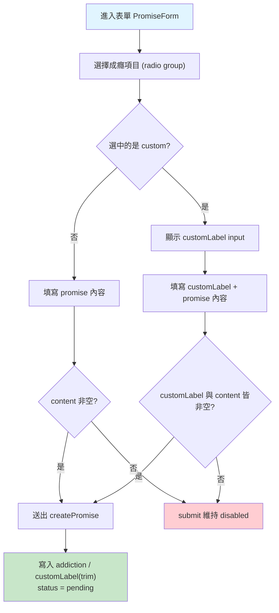
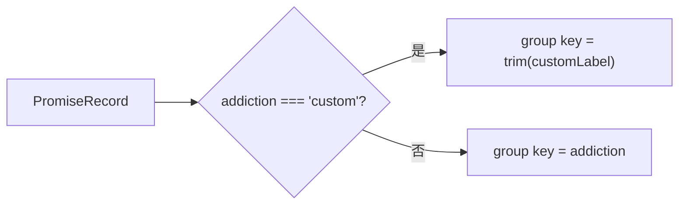

# 戒癮網站 - 文案／樣式修正與自定義成癮 (Daily Polish & Custom Addiction) PRD

**版本**：1.0
**建檔日期**：2026-07-10
**狀態**：待開發
**前置 PRD**：
- `docs/prd/done/promise-tracker-v1_20260621.md`（約定追蹤，含 `ADDICTIONS` 常數與資料模型）
- `docs/prd/done/promise-acknowledge-persistence-v1_20260708.md`（Back to home 確認與持久化）
- `docs/prd/done/trust-watching-ui-v1_20260707.md`（pending 狀態信任 UI）

---

## 1. 目標與願景

### 目標
- **文案**：稽核整個專案中所有「顯示給使用者」的英文文案，修正文法錯誤、錯字與大小寫不一致。
- **樣式**：將 PTT 與 X 兩個成癮項目的配色改為黑白（主色黑、次色白），符合其品牌識別。
- **功能**：在現有固定成癮項目之外，新增「Custom」選項；選擇後於下方顯示輸入欄位，讓使用者自行輸入想戒除的成癮（如菸癮、毒癮等）。自定義內容需可供未來圖表統計，**輸入內容經去頭尾空白後完全一樣者歸為同一類**。

### 願景
- **資料願景**：以最小侵入方式擴充資料模型（新增 `custom` key 與 `customLabel` 欄位），向後相容既有 IndexedDB 資料；圖表統計以「分類鍵（group key）」為單位，固定項目用 `addiction`，自定義用正規化後的 `customLabel`。
- **開發流程願景**：嚴格遵循 TDD（Red → Green → Refactor）。常數／型別／repository／元件皆先寫失敗測試再實作；以 `fake-indexeddb` 隔離 I/O。
- **UI 願景**：延續現有 radio group 樣式，Custom 為清單中的一顆按鈕；黑白配色與 Threads 一致，維持視覺中性。

### 本次範圍 / 非範圍
| 範圍 | 內容 |
|------|------|
| ✅ 本次範圍 | 文案全面稽核與修正、PTT／X 改黑白、新增 Custom 選項與輸入欄位、`customLabel` 持久化、分類鍵（group key）工具函式 |
| ❌ 非本次範圍 | 圖表／統計頁面本身（僅提供可被統計的資料與 group key 工具）、自定義項目的歷史清單／自動完成、後端同步 |

---

## 2. 功能詳述

### 2.1 文案稽核與修正

稽核範圍為所有 `render` 到畫面或 metadata 的使用者可見英文字串。目前已知需修正項：

| 位置 | 現況 | 問題 | 修正後 |
|------|------|------|--------|
| `PromiseResult.tsx` success message | `Awesome, you made it today! 🎉 AR Dog Can't wait to see you tomorrow! 🎉` | `Can't` 句中大寫錯誤（應小寫）；首尾雙 🎉 重複 | `Awesome, you made it today! 🎉 AR Dog can't wait to see you tomorrow!` |

> 其餘字串（`layout.tsx` title/description、`PromiseForm` legend/placeholder/label、`PromisePending` 信任訊息、`PromiseActions` 兩按鈕、`PromiseResult` failed message、`page.tsx` 標題與 Loading）於稽核任務中逐一確認；如發現新問題一併修正並補入本表。

**稽核清單（逐檔確認）**：
- `src/app/layout.tsx`：`title`、`description`
- `src/app/page.tsx`：`Daily Promise`、`Loading…`
- `src/components/PromiseForm.tsx`：legend、placeholder、`Your promise`、`Make a promise`
- `src/components/PromisePending.tsx`：`Your promise: …`、`AR Dog is watching you with strong trust.`
- `src/components/PromiseActions.tsx`：`I made it!`、`I didn't make it...`
- `src/components/PromiseResult.tsx`：success / failed message、`Back to home`

### 2.2 PTT／X 改黑白配色

| key | 現況 primary | 現況 secondary | 修正後 primary | 修正後 secondary |
|-----|------|------|------|------|
| `ptt` | `#2E7D32`（綠） | `#FFFFFF` | `#000000` | `#FFFFFF` |
| `x` | `#536471`（灰） | `#FFFFFF` | `#000000` | `#FFFFFF` |

> 選中時：黑底白字；未選中時：白底黑字黑框。與現有 Threads（`#000000`）視覺一致，符合需求「主要黑色、次要白色」。

### 2.3 新增 Custom 成癮選項

| # | 行為 | 說明 |
|---|------|------|
| 2.3.1 | Custom 按鈕 | 於 `ADDICTIONS` radio group 末端新增一顆 `Custom` 按鈕，配色黑白（primary `#000000`、secondary `#FFFFFF`）。 |
| 2.3.2 | 條件輸入欄位 | 當選中項為 `custom` 時，於 radio group 下方顯示一個文字 input（`customLabel`），placeholder 例如 `e.g. smoking, alcohol, gambling…`。未選 custom 時不顯示。 |
| 2.3.3 | 送出驗證 | 選 custom 時，`customLabel`（去頭尾空白後）與 `content`（promise 內容）皆須非空才可送出；否則 submit 鈕維持 disabled。 |
| 2.3.4 | 持久化 | 送出時寫入 `addiction: 'custom'` 與 `customLabel`（**已去頭尾空白**）。固定項目 `customLabel` 為 `undefined`。 |
| 2.3.5 | 結果顯示 | `PromiseResult` 於 `addiction === 'custom'` 時，標籤文字顯示 `customLabel`（而非固定 label `Custom`），配色沿用黑白。 |

### 2.4 分類鍵（Group Key）工具

提供純函式 `getAddictionGroupKey(record)`，供未來圖表以單一鍵分組：

- 固定項目 → 回傳 `record.addiction`（如 `'instagram-reels'`）。
- 自定義項目 → 回傳正規化後的 `customLabel`。正規化規則：**僅去頭尾空白（trim）**，大小寫與內部空白保留（「完全一樣」語意）。
- `customLabel` 在 `createPromise` 寫入時即已 trim，故 group key 與儲存值一致。

### 2.5 資料模型變更（Dexie table: `promises`）

沿用 `promise-tracker-v1` 結構，**新增一欄**（不需 Dexie schema migration，因非索引欄）：

| 欄位 | 型別 | 說明 |
|------|------|------|
| `addiction` | `AddictionKey`（新增 `'custom'` 成員） | 成癮項目 key |
| `customLabel` | `string \| undefined`（**新增**） | 使用者自定義成癮文字（已 trim）；僅 `addiction === 'custom'` 時有值 |

> `db.ts` 的 `stores` 索引維持 `'++id, &date, status'` 不變（`customLabel` 非索引欄，向後相容）。
> 註：既有 `&date` unique 索引已於後續 PRD 放寬為允許多筆／by acknowledge 驅動；本次不動索引定義，以現行 `src/lib/db.ts` 為準。

---

## 3. 業務邏輯圖

### 3.1 表單選擇與送出流程



### 3.2 分類鍵決策



---

## 4. 參考檔案路徑

```
src/
├── app/
│   ├── layout.tsx                          # 2.1 文案：title / description
│   ├── page.tsx                            # 2.1 文案；串接 customLabel → PromiseResult
│   └── __tests__/page.test.tsx             # 更新
├── constants/
│   ├── addictions.ts                       # 2.2 PTT/X 黑白；2.3 新增 custom key
│   └── __tests__/addictions.test.ts        # 更新
├── lib/
│   └── promises/
│       ├── types.ts                        # 2.5 新增 customLabel 欄位
│       ├── repository.ts                   # 2.3.4 createPromise 收 customLabel(trim)；2.4 getAddictionGroupKey
│       └── __tests__/repository.test.ts    # 更新
├── hooks/
│   ├── useTodayPromise.ts                  # submit 型別加 customLabel
│   └── __tests__/useTodayPromise.test.tsx  # 更新
└── components/
    ├── PromiseForm.tsx                     # 2.3.1~2.3.3 custom 按鈕 + 條件輸入 + 驗證
    ├── PromiseResult.tsx                   # 2.1 文案；2.3.5 custom 顯示 customLabel
    └── __tests__/                          # PromiseForm / PromiseResult 測試更新
```

---

## 5. 範例程式碼

### 5.1 成癮項目常數（`src/constants/addictions.ts`）
```ts
export const ADDICTIONS = [
  { key: 'instagram-reels', label: 'Instagram Reels', primary: '#E1306C', secondary: '#FFFFFF' },
  { key: 'facebook-reels', label: 'Facebook Reels', primary: '#1877F2', secondary: '#FFFFFF' },
  { key: 'youtube-shorts', label: 'YouTube Shorts', primary: '#FF0000', secondary: '#FFFFFF' },
  { key: 'threads', label: 'Threads', primary: '#000000', secondary: '#FFFFFF' },
  { key: 'x', label: 'X', primary: '#000000', secondary: '#FFFFFF' },          // 改黑白
  { key: 'reddit', label: 'Reddit', primary: '#FF4500', secondary: '#FFFFFF' },
  { key: 'ptt', label: 'PTT', primary: '#000000', secondary: '#FFFFFF' },      // 改黑白
  { key: 'custom', label: 'Custom', primary: '#000000', secondary: '#FFFFFF' }, // 新增
] as const;

export type AddictionKey = (typeof ADDICTIONS)[number]['key'];

export const CUSTOM_KEY = 'custom' satisfies AddictionKey;
```

### 5.2 型別（`src/lib/promises/types.ts`）
```ts
export interface PromiseRecord {
  id?: number;
  date: string;
  addiction: AddictionKey;      // 現含 'custom'
  customLabel?: string;         // 新增：僅 custom 時有值（已 trim）
  content: string;
  status: PromiseStatus;
  createdAt: number;
  updatedAt: number;
  acknowledgedAt?: number;
}
```

### 5.3 Repository（`src/lib/promises/repository.ts`）
```ts
export async function createPromise(input: {
  addiction: AddictionKey;
  content: string;
  customLabel?: string;
}): Promise<PromiseRecord> {
  const now = Date.now();
  const customLabel =
    input.addiction === 'custom' ? input.customLabel?.trim() || undefined : undefined;

  const record: PromiseRecord = {
    date: getToday(),
    addiction: input.addiction,
    ...(customLabel ? { customLabel } : {}),
    content: input.content,
    status: 'pending',
    createdAt: now,
    updatedAt: now,
  };
  const id = await db.promises.add(record);
  return { ...record, id };
}

// 2.4 圖表分組鍵：固定項目用 addiction；自定義用 trim 後的 customLabel
export function getAddictionGroupKey(
  record: Pick<PromiseRecord, 'addiction' | 'customLabel'>,
): string {
  if (record.addiction === 'custom') return (record.customLabel ?? '').trim();
  return record.addiction;
}
```

### 5.4 PromiseForm 自定義輸入（片段）
```tsx
const isCustom = addiction === 'custom';
const trimmedContent = content.trim();
const trimmedCustom = customLabel.trim();
const canSubmit =
  trimmedContent.length > 0 && (!isCustom || trimmedCustom.length > 0);

// radio group 之後：
{isCustom && (
  <label className="flex flex-col gap-2">
    <span className="text-lg font-semibold">What do you want to quit?</span>
    <input
      value={customLabel}
      onChange={(e) => setCustomLabel(e.target.value)}
      placeholder="e.g. smoking, alcohol, gambling…"
      className="rounded border border-zinc-300 px-3 py-2 dark:border-zinc-700 dark:bg-zinc-900"
    />
  </label>
)}

// submit：
onSubmit({ addiction, content: trimmedContent, customLabel: isCustom ? trimmedCustom : undefined });
```

### 5.5 PromiseResult 顯示 customLabel（片段）
```tsx
const selected = ADDICTIONS.find((item) => item.key === addiction) ?? ADDICTIONS[0];
const displayLabel = addiction === 'custom' ? customLabel : selected.label;
// …<span style={{...selected 配色...}}>{displayLabel}</span>
```

### 5.6 文案修正（`PromiseResult.tsx`）
```diff
- message: "Awesome, you made it today! 🎉 AR Dog Can't wait to see you tomorrow! 🎉",
+ message: "Awesome, you made it today! 🎉 AR Dog can't wait to see you tomorrow!",
```

---

## 6. 驗證項目

### 單元測試（`npm test`）
- [ ] `addictions.test.ts`：
  - `ptt`、`x` 的 primary 為 `#000000`、secondary 為 `#FFFFFF`
  - 存在 `custom` 項目，label 為 `Custom`、黑白配色
- [ ] `repository.test.ts`：
  - `createPromise` 帶 `addiction: 'custom'` + `customLabel: '  smoking  '` → 儲存 `customLabel === 'smoking'`（trim）
  - 固定項目送出時 `customLabel` 為 `undefined`
  - `getAddictionGroupKey`：固定項目回傳 addiction；custom 回傳 trim 後 customLabel；`'Smoking'` 與 `'smoking'` 視為不同 key（保留大小寫）
- [ ] `PromiseForm` 測試：
  - 選 Custom → 顯示 customLabel input；未選 → 不顯示
  - Custom 且 customLabel 空 → submit disabled；填入後可送出，callback 帶正確 customLabel
  - 非 custom 行為不變（既有測試綠燈）
- [ ] `PromiseResult` 測試：
  - `addiction='custom'` + `customLabel='smoking'` → 顯示 `smoking`
  - success message 為修正後文案（不含 `Can't`、無雙 🎉）
- [ ] `useTodayPromise.test.tsx`：`submit` 可傳遞 `customLabel` 至 repository

### 執行驗證
- [ ] `npm run build` 成功
- [ ] `npm run lint` 無錯誤
- [ ] `npm run typecheck`（`tsc --noEmit`）無錯誤

### 瀏覽器手動驗證
- [ ] PTT、X 選中呈黑底白字、未選白底黑字
- [ ] 點 Custom → 下方出現輸入欄；輸入成癮 + promise 後可送出
- [ ] 送出 custom 後，結果畫面標籤顯示使用者輸入的文字
- [ ] 成功畫面文案為修正後版本
- [ ] DevTools → IndexedDB → `promises`：custom 紀錄含 `customLabel`（已 trim）

---

## 7. 開發任務清單 (TODO)

### 任務劃分原則
- 每個任務 ≤ 1 天，嚴格 TDD（先寫失敗測試 → 最小實作 → 重構）。
- 基礎優先：常數／型別 → repository → hook → 元件 → 頁面串接 → 整合驗證。

| # | 任務 | 預估 | 依賴 | 驗證項目 |
|---|------|------|------|---------|
| T1 | 文案全面稽核（§2.1 清單逐檔），列出所有需修正項並修正已知 `PromiseResult` success 文案（TDD：斷言新字串） | 1h | - | `PromiseResult` 測試綠燈；稽核清單完成 |
| T2 | `addictions.ts`：PTT／X 改黑白、新增 `custom` 項與 `CUSTOM_KEY`（TDD：`addictions.test.ts`） | 0.5h | - | `addictions.test.ts` 綠燈；`typecheck` 無誤 |
| T3 | `types.ts`：新增 `customLabel?: string`（`AddictionKey` 已含 custom） | 0.5h | T2 | `npm run typecheck` 無錯誤 |
| T4 | `repository.ts`：`createPromise` 接收並 trim `customLabel`；新增 `getAddictionGroupKey`（TDD） | 1.5h | T3 | `repository.test.ts` 綠燈（含 trim、group key 大小寫案例） |
| T5 | `useTodayPromise`：`submit` 型別加入 `customLabel` 並透傳（TDD） | 0.5h | T4 | `useTodayPromise.test.tsx` 綠燈 |
| T6 | `PromiseForm`：新增 Custom 條件 input、送出驗證與 callback（TDD） | 1.5h | T2 | `PromiseForm` 測試綠燈；custom 空值不可送出 |
| T7 | `PromiseResult`：custom 顯示 `customLabel`（新增 prop）（TDD） | 1h | T2 | `PromiseResult` 測試綠燈 |
| T8 | `page.tsx`：串接 `customLabel` → `PromiseResult`；表單 submit 透傳 | 0.5h | T5,T6,T7 | `page.test.tsx` 更新並綠燈 |
| T9 | 整合驗證：build / lint / typecheck + §6 瀏覽器手動驗證 | 1h | T1-T8 | §6 全部驗證項目通過 |

**預計總工時**：約 8 小時（約 1.5 個工作天）

---

## 附錄：後續工作（非本次範圍）
1. **統計圖表頁**：以 `getAddictionGroupKey` 為分組單位，統計各成癮（含自定義）的成功率與趨勢。
2. **自定義項目建議**：記錄使用者曾輸入過的 `customLabel`，提供自動完成或快速選取。
3. **多語系文案**：若未來支援中文介面，將硬編碼英文字串抽出為 i18n 資源。

---

**核准者**：待確認
**最後更新**：2026-07-10
