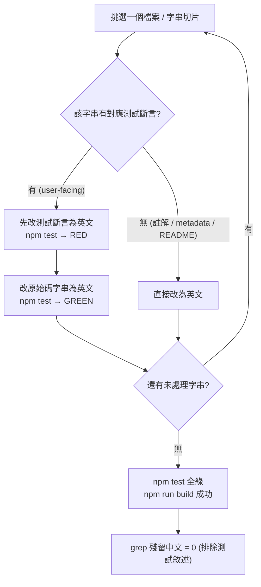
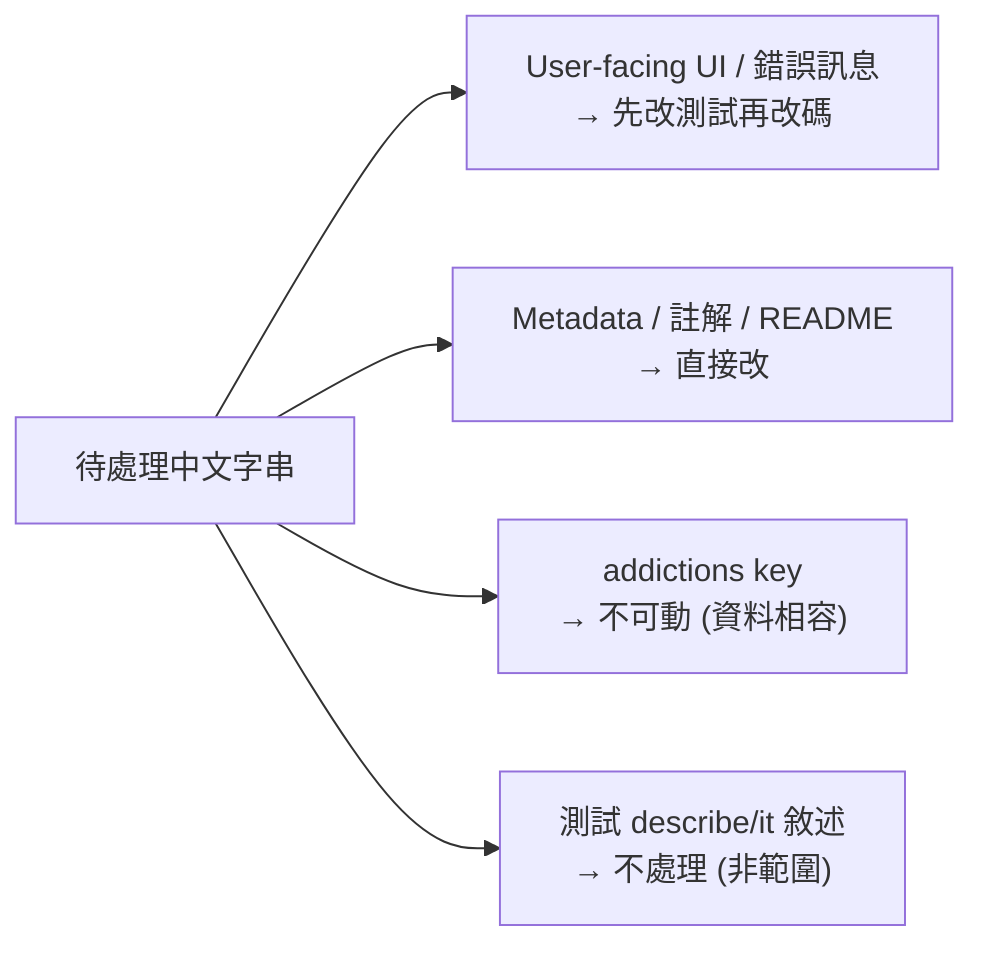

# 戒癮網站 - 英文化 / 國際化第一步 (English Localization) PRD

**版本**：1.0
**建檔日期**：2026-06-22
**狀態**：待開發
**前置 PRD**：`docs/prd/done/promise-tracker-v1_20260621.md`（約定追蹤功能已完成）
**原始需求**：`docs/prd/20260622-1.md`

---

## 1. 目標與願景

### 目標
- 將專案現有寫死的**中文使用者介面文案全面改為英文**，使產品以英文為主要語言、面向國際使用者。
- 涵蓋範圍：UI 文案、`<head>` metadata（title / description）、成癮項目 label、使用者可見的錯誤訊息、程式碼註解、`README.md`。
- 同步更新會因字串改動而失敗的測試斷言，保持 `npm test` 全綠。

### 願景
- **語言願景**：產品走向國際化，**英文優先（English-first）**。
- **架構願景（本次採用）**：採**純英文內聯替換**——直接將字串改為英文，**不抽離字串字典、不導入任何 i18n 套件**，遵循 YAGNI（現在不需要多語系就不預先建置）。
- **未來方向（非本次）**：待真正需要多語系時，再以獨立 PRD 導入 i18n 機制（例如字串字典或 `next-intl`），本次不為其預留抽象層。

### 本次範圍 / 非範圍
| 範圍 | 內容 |
|------|------|
| ✅ 本次範圍 | UI 文案英文化、metadata 英文化、addictions label 英文化、可見錯誤訊息英文化、`src` 內中文註解英文化、README 英文化、同步修正受影響測試斷言 |
| ❌ 非本次範圍 | 導入 i18n 套件或字串字典、語言切換 UI、多語系資料結構、`describe`/`it` 測試敘述文字的翻譯（內部規格，維持現狀）、新功能 |

---

## 2. 功能詳述

| # | 項目 | 說明 |
|---|------|------|
| 2.1 | UI 文案英文化 | `page.tsx`、`PromiseForm.tsx`、`PromiseResult.tsx` 內所有中文可見文字改為英文。`PromiseActions.tsx` 已是英文，僅需確認。 |
| 2.2 | Metadata 英文化 | `layout.tsx` 的 `metadata.title` / `metadata.description` 改為英文；`<html lang>` 已為 `en`，確認即可。 |
| 2.3 | 成癮項目 label 英文化 | `addictions.ts` 中唯一的中文 label `Facebook 短影片` 改為 `Facebook Reels`；其餘已是英文。**`key` 不可變動**（為資料庫儲存值，變動會破壞既有紀錄）。 |
| 2.4 | 可見錯誤訊息英文化 | `repository.ts` 中 `throw new Error('今日尚無約定…')` 的訊息改為英文。 |
| 2.5 | 程式碼註解英文化 | `db.ts`、`date.ts`、`repository.ts` 內的中文註解改為英文。 |
| 2.6 | README 英文化 | `README.md` 由中文改寫為英文。 |
| 2.7 | 測試斷言同步更新 | 更新因 2.1〜2.4 改動而失效的測試（user-facing 字串斷言與 `CONTENT` 測試常數），維持測試全綠。 |

### 2.8 字串對照表（Canonical Mapping）

> 以下為建議英文文案，實作時以此為準；如需微調用詞請於實作前確認。

| 檔案 | 位置 | 現值（中文） | 目標（英文） |
|------|------|--------------|--------------|
| `layout.tsx` | `metadata.title` | `戒癮網站` | `Addiction Rehab Dog` |
| `layout.tsx` | `metadata.description` | `與自己立下約定，逐日紀錄是否達成，慢慢戒除成癮。` | `Make a promise to yourself, track it day by day, and break your addiction one step at a time.` |
| `page.tsx` | `h1` | `戒癮約定` | `Daily Promise` |
| `page.tsx` | loading 文字 | `載入中…` | `Loading…` |
| `page.tsx` | pending 文字 | `今日約定：{content}` | `Today's promise: {content}` |
| `PromiseForm.tsx` | `legend` | `想戒除什麼？` | `What do you want to quit?` |
| `PromiseForm.tsx` | 標題 | `今天的約定` | `Today's promise` |
| `PromiseForm.tsx` | `placeholder` | `例：我今天完全不開啟 IG 滑短影音` | `e.g. I won't open Instagram Reels at all today` |
| `PromiseForm.tsx` | submit 按鈕 | `訂下約定` | `Make a promise` |
| `PromiseResult.tsx` | success `alt` | `開心的狗狗` | `Happy dog` |
| `PromiseResult.tsx` | success `message` | `太棒了，今天你做到了！🎉` | `Awesome, you made it today! 🎉` |
| `PromiseResult.tsx` | failed `alt` | `沮喪的狗狗` | `Sad dog` |
| `PromiseResult.tsx` | failed `message` | `沒關係，明天再試一次吧…` | `It's okay — try again tomorrow…` |
| `addictions.ts` | `facebook-reels` label | `Facebook 短影片` | `Facebook Reels` |
| `repository.ts` | Error message | `今日尚無約定，無法更新狀態` | `No promise exists for today; cannot update status.` |

### 2.9 受影響測試清單

| 測試檔 | 受影響斷言 / 常數 |
|--------|-------------------|
| `src/app/__tests__/page.test.tsx` | `getByText('載入中…')` → `'Loading…'`；`getByRole('button', { name: '訂下約定' })` → `'Make a promise'`；`content` 測試資料 |
| `src/components/__tests__/PromiseForm.test.tsx` | `getByRole('button', { name: '訂下約定' })`（2 處）→ `'Make a promise'`；`CONTENT` 常數 |
| `src/components/__tests__/PromiseResult.test.tsx` | 若以 `alt` 查詢圖片需同步（`getByAltText`）；確認斷言依新文案 |
| `src/hooks/__tests__/useTodayPromise.test.tsx` | `CONTENT` 常數 |
| `src/lib/promises/__tests__/repository.test.ts` | `CONTENT` 常數；若斷言 Error 訊息字串需同步 |
| `src/components/__tests__/PromiseActions.test.tsx` | 按鈕本已英文，**預期無需改動**（確認即可） |

> `describe` / `it` 的中文敘述文字屬內部規格，**非本次範圍**，維持現狀。

---

## 3. 業務邏輯圖

### 3.1 英文化工作流程（依 TDD：先紅後綠）



### 3.2 字串分類決策



---

## 4. 參考檔案路徑

| 路徑 | 說明 | 本次動作 |
|------|------|----------|
| `src/app/layout.tsx` | 根 layout 與 `<head>` metadata | 改 title / description |
| `src/app/page.tsx` | 首頁，含 h1、loading、pending 文案 | 改 UI 字串 + 同步測試 |
| `src/components/PromiseForm.tsx` | 訂約定表單 | 改 legend / 標題 / placeholder / 按鈕 + 同步測試 |
| `src/components/PromiseResult.tsx` | 成功 / 失敗狗狗回饋 | 改 alt / message + 同步測試 |
| `src/components/PromiseActions.tsx` | 「I made it!」/「I didn't make it...」 | 確認（已英文，預期不動） |
| `src/constants/addictions.ts` | 成癮項目清單 | 改 `facebook-reels` 的 label（key 不動） |
| `src/lib/db.ts` | Dexie schema | 註解英文化 |
| `src/lib/date.ts` | 日期工具 | 註解英文化 |
| `src/lib/promises/repository.ts` | 約定 repository | 錯誤訊息 + 註解英文化 + 同步測試 |
| `src/**/__tests__/*` | 受影響測試 | 同步 user-facing 斷言與 `CONTENT` 常數 |
| `README.md` | 專案說明 | 改寫為英文 |

---

## 5. 範例程式碼

### 5.1 `layout.tsx` metadata

```tsx
export const metadata: Metadata = {
  title: 'Addiction Rehab Dog',
  description:
    'Make a promise to yourself, track it day by day, and break your addiction one step at a time.',
};
```

### 5.2 `addictions.ts`（僅改 label，key 不變）

```ts
export const ADDICTIONS = [
  { key: 'instagram-reels', label: 'Instagram Reels' },
  { key: 'facebook-reels', label: 'Facebook Reels' }, // was: 'Facebook 短影片'
  { key: 'youtube-shorts', label: 'YouTube Shorts' },
  { key: 'threads', label: 'Threads' },
  { key: 'x', label: 'X' },
  { key: 'reddit', label: 'Reddit' },
  { key: 'ptt', label: 'PTT' },
] as const;
```

### 5.3 TDD 範例：`PromiseForm` 送出按鈕（先紅後綠）

```tsx
// 1) RED — 先改測試斷言（PromiseForm.test.tsx）
await user.click(screen.getByRole('button', { name: 'Make a promise' }));

// 2) GREEN — 再改原始碼（PromiseForm.tsx）
<button type="submit" disabled={!canSubmit} className="...">
  Make a promise
</button>
```

### 5.4 `repository.ts` 錯誤訊息與註解

```ts
const id = await db.promises.add(record); // date is unique → adding twice on the same day throws
// ...
if (!today?.id) throw new Error('No promise exists for today; cannot update status.');
```

---

## 6. 驗證項目

### 6.1 單元測試
- `npm test` → 全數通過（含同步更新後的 `page`、`PromiseForm`、`PromiseResult`、`useTodayPromise`、`repository` 測試）。

### 6.2 執行 / 建置驗證
- `npm run typecheck` → 無型別錯誤（addictions `key` 型別未變，`AddictionKey` 不受影響）。
- `npm run build` → 建置成功。
- `npm run lint` → 無新增 lint 錯誤。

### 6.3 殘留中文掃描
- `grep -rn '[一-龥]' src --include='*.tsx' --include='*.ts' | grep -v '__tests__'` → **0 筆**（原始碼無殘留中文，含註解）。
- `README.md` 以肉眼確認無中文段落。
- 允許殘留：`src/**/__tests__/*` 的 `describe`/`it` 中文敘述（非本次範圍）。

### 6.4 瀏覽器內驗證（`npm run dev`）
- 首頁標題顯示 `Daily Promise`；表單 legend、placeholder、按鈕皆為英文。
- 送出約定 → 顯示 `Today's promise: ...` 與兩顆英文按鈕。
- 按 `I made it!` → 開心狗狗 + `Awesome, you made it today! 🎉`。
- 按 `I didn't make it...` → 沮喪狗狗 + `It's okay — try again tomorrow…`。
- 瀏覽器分頁標題顯示 `Addiction Rehab Dog`。

---

## 7. 開發任務清單 (TODO)

> 原則：每項任務 ≤ 1 天（多數 < 1 小時）。user-facing 字串依 TDD「先改測試（RED）→ 再改原始碼（GREEN）」；註解 / metadata / README 可直接修改。

| # | 任務 | 預估 | 依賴 | 驗證 |
|---|------|------|------|------|
| 1 | `addictions.ts`：`facebook-reels` label 改為 `Facebook Reels`（key 不動） | 0.2h | - | `PromiseForm.test.tsx`（項目清單測試）通過、`npm run typecheck` 綠 |
| 2 | `layout.tsx`：metadata title / description 英文化，確認 `<html lang="en">` | 0.2h | - | `npm run build` 綠、分頁標題為英文 |
| 3 | `page.tsx`：h1 / loading / pending 文案英文化，並同步 `page.test.tsx` 斷言（先紅後綠） | 0.5h | - | `page.test.tsx` 通過 |
| 4 | `PromiseForm.tsx`：legend / 標題 / placeholder / 按鈕英文化，並同步 `PromiseForm.test.tsx`（按鈕 name、`CONTENT`） | 0.5h | 1 | `PromiseForm.test.tsx` 通過 |
| 5 | `PromiseResult.tsx`：success / failed 的 `alt` 與 `message` 英文化，並同步 `PromiseResult.test.tsx` | 0.4h | - | `PromiseResult.test.tsx` 通過 |
| 6 | `PromiseActions.tsx`：確認已英文（預期不動）；同步檢查其測試 | 0.1h | - | `PromiseActions.test.tsx` 通過 |
| 7 | `repository.ts`：Error 訊息與註解英文化，並同步 `repository.test.ts`（`CONTENT`、必要時 Error 斷言） | 0.4h | - | `repository.test.ts` 通過 |
| 8 | `useTodayPromise.test.tsx`：`CONTENT` 常數英文化（hook 無 UI 字串） | 0.2h | - | `useTodayPromise.test.tsx` 通過 |
| 9 | `db.ts`、`date.ts`：中文註解英文化 | 0.2h | - | `npm test` 綠、註解為英文 |
| 10 | `README.md`：改寫為英文 | 0.6h | - | 肉眼確認無中文段落 |
| 11 | 全域驗收：`npm test` / `npm run typecheck` / `npm run build` / `npm run lint` 全綠 + 殘留中文掃描（排除測試敘述）= 0 | 0.3h | 1–10 | 6.1〜6.4 全數通過 |

---

## 附錄：未來多語系（非本次）

本次刻意不建置 i18n 抽象層。待真正需要多語系時，建議另立 PRD 處理：
- 評估字串字典（`src/i18n/<locale>.ts`）或 `next-intl` 等方案。
- 屆時 `addictions.ts` 的 `key`（已與 label 分離）可直接作為 i18n key 使用，遷移成本低。
- 語言切換 UI 與偏好儲存。
