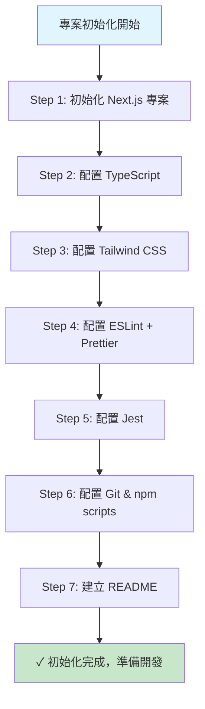

# 戒癮網站 - 專案初始化 PRD

**版本**：1.0  
**建檔日期**：2026-06-20  
**狀態**：待開發

---

## 1. 目標與願景

### 目標
- 建立戒癮網站專案的初始化基礎結構
- 配置開發環境所需的全部工具、框架與規範
- 建立可立即開始功能開發的專案骨架

### 願景
- **技術願景**：採用現代化技術棧（Next.js 13+ App Router、TypeScript），實現類型安全、高效開發
- **開發流程願景**：通過 ESLint、Prettier、Jest 單元測試，建立高品質代碼規範與可靠性保障
- **架構方向**：前後端一體化（Next.js API Routes），簡化部署與維護

---

## 2. 功能詳述

| # | 功能 | 說明 |
|---|------|------|
| 2.1 | Next.js 專案初始化 | 使用 `create-next-app` 建立 Next.js 專案（使用 App Router） |
| 2.2 | TypeScript 配置 | 配置 `tsconfig.json`，啟用嚴格模式，設定路徑別名 (`@/`) |
| 2.3 | Tailwind CSS 配置 | 配置 `tailwind.config.ts` 與 `postcss.config.js`，集成 Tailwind 樣式系統 |
| 2.4 | ESLint 規範 | 配置 `.eslintrc.json`，集成 Next.js、React、TypeScript 規則 |
| 2.5 | Prettier 格式化 | 配置 `.prettierrc`，設定程式碼格式化規則 |
| 2.6 | Jest 單元測試框架 | 配置 `jest.config.js` 與 `jest.setup.js`，支持 TypeScript 測試 |
| 2.7 | Git 與 npm scripts | 配置 `.gitignore`、`package.json` scripts（`dev`、`build`、`test`、`lint`） |
| 2.8 | README 文檔 | 建立 README.md，包含專案介紹、安裝與開發流程說明 |

---

## 3. 業務邏輯圖



---

## 4. 參考檔案路徑

初始化完成後，預期專案結構如下：

```
Addiction-rehab-dog/
├── .eslintrc.json
├── .gitignore
├── .prettierrc
├── jest.config.js
├── jest.setup.js
├── tsconfig.json
├── next.config.js
├── tailwind.config.ts
├── postcss.config.js
├── package.json
├── package-lock.json
├── README.md
├── public/               # 靜態資源
├── src/
│   ├── app/            # Next.js App Router
│   │   ├── layout.tsx
│   │   ├── page.tsx
│   │   └── globals.css
│   └── __tests__/      # 單元測試目錄
└── docs/
    └── prd/            # 本 PRD 檔案
```

---

## 5. 範例程式碼

### 5.1 TypeScript 路徑別名設定 (tsconfig.json)
```json
{
  "compilerOptions": {
    "target": "ES2020",
    "lib": ["ES2020", "DOM", "DOM.Iterable"],
    "jsx": "preserve",
    "module": "ESNext",
    "moduleResolution": "bundler",
    "strict": true,
    "esModuleInterop": true,
    "skipLibCheck": true,
    "forceConsistentCasingInFileNames": true,
    "resolveJsonModule": true,
    "baseUrl": ".",
    "paths": {
      "@/*": ["./src/*"]
    }
  },
  "include": ["next-env.d.ts", "**/*.ts", "**/*.tsx", ".next/types/**/*.ts"],
  "exclude": ["node_modules"]
}
```

### 5.2 Jest 配置 (jest.config.js)
```javascript
const nextJest = require('next/jest')

const createJestConfig = nextJest({
  dir: './',
})

module.exports = createJestConfig({
  setupFilesAfterEnv: ['<rootDir>/jest.setup.js'],
  moduleNameMapper: {
    '^@/(.*)$': '<rootDir>/src/$1',
  },
  testEnvironment: 'jest-environment-jsdom',
  testMatch: ['**/__tests__/**/*.test.ts', '**/__tests__/**/*.test.tsx'],
})
```

### 5.3 ESLint 配置 (.eslintrc.json)
```json
{
  "extends": ["next/core-web-vitals"],
  "rules": {
    "react-hooks/rules-of-hooks": "error",
    "react-hooks/exhaustive-deps": "warn"
  }
}
```

### 5.4 npm scripts (package.json 摘要)
```json
{
  "scripts": {
    "dev": "next dev",
    "build": "next build",
    "start": "next start",
    "lint": "eslint src --ext .ts,.tsx",
    "format": "prettier --write src",
    "test": "jest",
    "test:watch": "jest --watch"
  },
  "devDependencies": {
    "next": "^14.0.0",
    "react": "^18.0.0",
    "react-dom": "^18.0.0",
    "typescript": "^5.0.0",
    "@types/node": "^20.0.0",
    "@types/react": "^18.0.0",
    "tailwindcss": "^3.4.0",
    "postcss": "^8.4.0",
    "autoprefixer": "^10.4.0",
    "eslint": "^8.0.0",
    "eslint-config-next": "^14.0.0",
    "prettier": "^3.0.0",
    "jest": "^29.0.0",
    "jest-environment-jsdom": "^29.0.0",
    "@testing-library/react": "^14.0.0",
    "@testing-library/jest-dom": "^6.0.0"
  }
}
```

---

## 6. 驗證項目

### 單元測試
- [ ] `npm test` 執行成功，無測試報告 (因為初始化後無測試)

### 執行驗證
- [ ] `npm run dev` 開啟開發伺服器，訪問 `http://localhost:3000` 可看到 Next.js 預設首頁
- [ ] `npm run build` 成功編譯，無錯誤
- [ ] `npm run lint` 執行無錯誤（初始化代碼符合規範）
- [ ] `npm run format` 執行成功

### 環境驗證
- [ ] TypeScript 編譯無錯誤 (`npx tsc --noEmit`)
- [ ] Tailwind CSS 樣式載入正常
- [ ] ESLint + Prettier 整合正常（可在編輯器中自動格式化）

---

## 7. 開發任務清單 (TODO)

### 任務劃分原則
- 每個任務 ≤ 1 天（4-6 小時）
- 按依賴關係排序，優先完成無依賴的基礎設施

| # | 任務 | 預估 | 依賴 | 驗證項目 |
|---|------|------|------|---------|
| T1 | 初始化 Next.js 專案架構 | 0.5h | - | `npm run dev` 訪問 http://localhost:3000 成功 |
| T2 | 配置 TypeScript（tsconfig.json、路徑別名） | 0.5h | T1 | `npx tsc --noEmit` 無錯誤 |
| T3 | 配置 Tailwind CSS（tailwind.config.ts、postcss） | 0.5h | T1 | 樣式文件載入，瀏覽器無警告 |
| T4 | 配置 ESLint（.eslintrc.json、規則） | 0.5h | T2 | `npm run lint` 執行無錯誤 |
| T5 | 配置 Prettier（.prettierrc、與 ESLint 整合） | 0.5h | T4 | `npm run format` 執行成功 |
| T6 | 配置 Jest（jest.config.js、jest.setup.js） | 1h | T2 | `npm test` 執行成功（無測試時為 0 tests） |
| T7 | 建立 .gitignore 與 Git 初始化 | 0.5h | T1 | `git status` 顯示正確的未追蹤檔案 |
| T8 | 配置 package.json scripts | 0.5h | T6 | 所有 scripts (`dev`, `build`, `test`, `lint`, `format`) 可執行 |
| T9 | 建立 README.md（專案介紹、安裝、開發流程） | 1h | T8 | README 包含完整說明 |
| T10 | 執行完整驗證與檢查 | 0.5h | T1-T9 | 所有驗證項目 (§6) 通過 |

**預計總工時**：約 6 小時（1 個工作天）

---

## 附錄：後續工作

初始化完成後，下一步將進行核心功能開發：
1. **用戶認證系統**（登入、註冊、密碼重置）
2. **約定管理**（建立約定、查看約定、編輯約定）
3. **打卡系統**（每日打卡記錄、進度追蹤）
4. **統計與數據展示**（完成率、連續天數等）

詳細需求見後續 PRD 文檔。

---

**核准者**：待確認  
**最後更新**：2026-06-20
