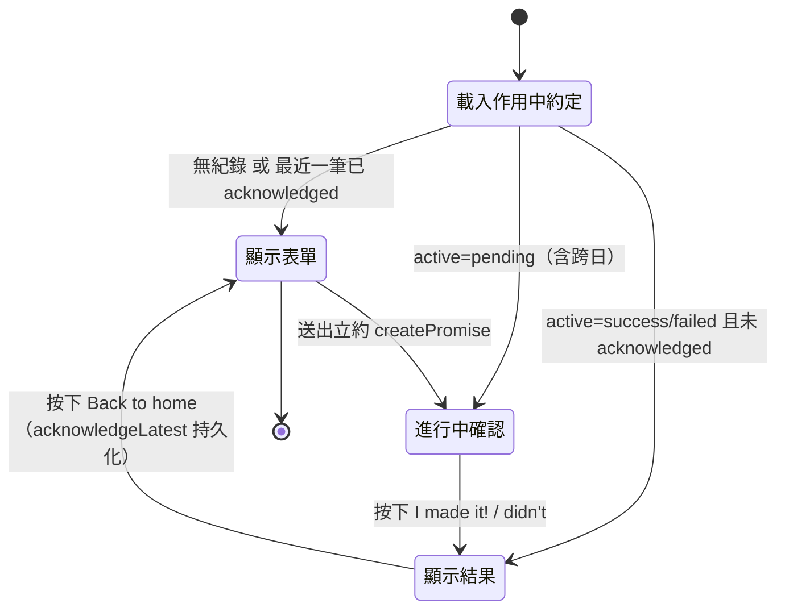
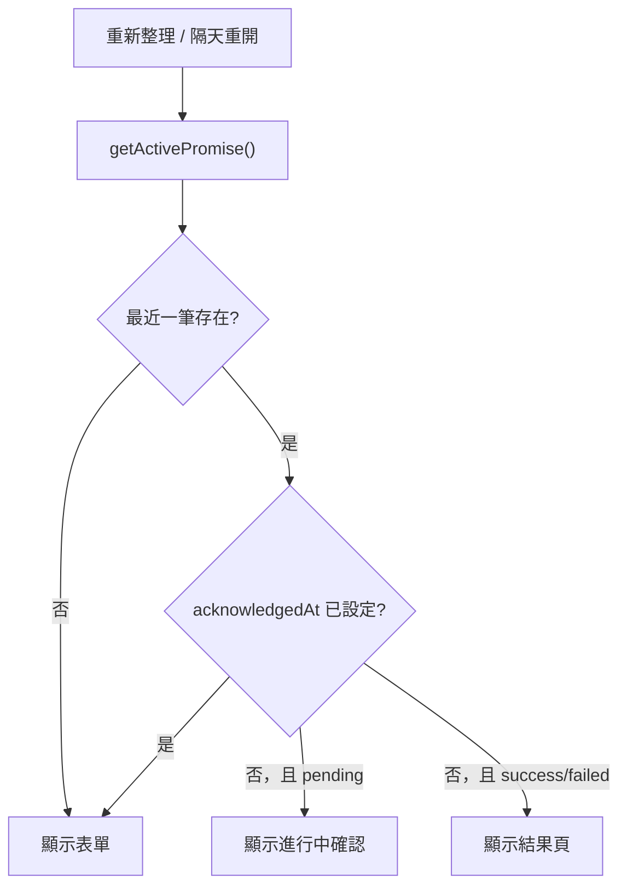
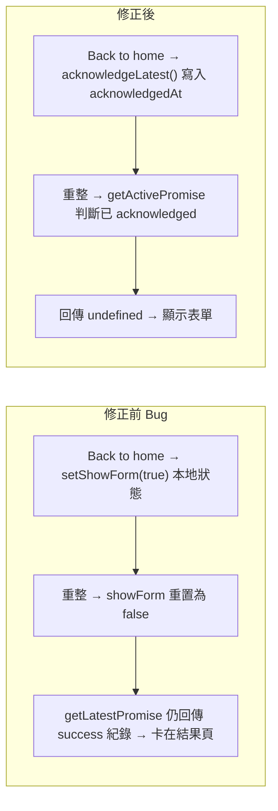

# 戒癮網站 - 結果頁確認持久化（Result Reset on Revisit）PRD

**版本**：1.0
**建檔日期**：2026-07-08
**狀態**：待開發
**前置 PRD**：
- `docs/prd/done/promise-persistence-ui-v1_20260628.md`（跨日不重置、Back to home、最近一筆驅動）
- `docs/prd/done/trust-watching-ui-v1_20260707.md`（信任觀察 UI）

**原始需求**：`docs/prd/20260708.md`

> 原始需求原文：
> - 要避免隔天再次進入頁面時直接跳進 result 頁面。現況是已經按了回首頁、重新整理後仍然停留在 result 頁面。

---

## 1. 目標與願景

### 目標
- **修正「Back to home 無法持久」的 Bug**：使用者在結果頁按下 `Back to home` 後，**重新整理或隔天重開頁面時，不再跳回 result 頁面**，而是回到立約表單。
- **持久化「確認離開結果頁」狀態**：將原本僅存在於記憶體（React `useState.showForm`）的「回首頁」意圖，改為寫入 IndexedDB，使其能跨重新整理 / 跨日保留。
- **不刪除歷史紀錄**：確認離開只是「歸檔／確認」該筆約定，紀錄仍保留於資料庫，為未來歷史功能鋪路。
- 維持 `npm test` 全綠，遵循 TDD（先紅後綠）。

### 願景
- **體驗願景**：使用者對某筆約定按下 `Back to home` 代表「這一輪已結束」，系統應忠實記住此決定，讓下次進入（不論同日重整或隔日）都以「乾淨的立約表單」迎接，避免被舊結果頁困住。
- **架構願景**：
  - 導入「**作用中約定（active promise）**」概念：驅動畫面的不再只是「最近一筆」，而是「最近一筆且尚未被確認離開」的約定。
  - 以資料欄位 `acknowledgedAt`（時間戳）表達「已確認離開結果頁」的終態，取代不可持久的本地 `showForm` 狀態。
  - 由於 `acknowledgedAt` 為**非索引欄位**，Dexie schema **無需升版**（不變更索引定義）。

### 本次範圍 / 非範圍
| 範圍 | 內容 |
|------|------|
| ✅ 本次範圍 | 新增 `acknowledgedAt` 欄位（type）、`acknowledgeLatest()` 與 `getActivePromise()` 倉儲函式、`useTodayPromise` 改用 active promise 並新增 `acknowledge`、`page.tsx` 移除本地 `showForm` 改以持久狀態驅動、同步受影響測試 |
| ❌ 非本次範圍 | 歷史紀錄清單 / 月曆檢視、streak 統計、**未按 Back to home 就跨日**時的自動歸檔（見下方假設）、多筆同時進行、動畫過場、i18n |

### 關鍵設計假設（請確認）
- **只有「已確認離開（acknowledged）」的完成紀錄才會被隱藏**。若使用者完成約定（success/failed）後**未按 Back to home** 就直接關閉，隔日重開仍會顯示該筆結果頁（維持既有「使用者親自掌控節奏」的設計哲學）。
- 若日後希望「完成後跨日即自動視為結束」，可另立任務加入「跨日自動 acknowledge」邏輯（非本次範圍）。

---

## 2. 功能詳述

| # | 項目 | 說明 |
|---|------|------|
| 2.1 | 新增 `acknowledgedAt` 欄位 | `PromiseRecord` 新增選用欄位 `acknowledgedAt?: number`；預設不存在（`undefined`）代表「尚未確認離開」。 |
| 2.2 | `acknowledgeLatest()` 倉儲函式 | 將**最近一筆**的 `acknowledgedAt` 設為 `Date.now()`；無任何紀錄時丟錯。（實作上更新 `getLatestPromise()` 取得之 `id`。） |
| 2.3 | `getActivePromise()` 倉儲函式 | 回傳「驅動畫面的約定」：取最近一筆，若該筆已 `acknowledgedAt` 則回傳 `undefined`（視為無作用中約定 → 顯示表單）；否則回傳該筆。 |
| 2.4 | `useTodayPromise` 改用 active promise | hook 的初始載入與 `refresh` 由 `getLatestPromise` 改為 `getActivePromise`；`promise` 介面型別不變。 |
| 2.5 | `useTodayPromise` 新增 `acknowledge` | hook 新增 `acknowledge()`：呼叫 `acknowledgeLatest()` 後 `refresh()`，使 `promise` 變為 `undefined`（回到表單）。 |
| 2.6 | `page.tsx` 移除 `showForm`，改持久驅動 | 移除本地 `useState(showForm)`；`PromiseResult` 的 `onBackHome` 改綁定 hook 的 `acknowledge`；畫面完全由 `promise`（active）決定。 |
| 2.7 | 測試同步更新 | 同步 repository / hook / page 因新增 active/acknowledge 邏輯而受影響的測試（先紅後綠）。 |

### 2.8 狀態與畫面對照（State → View）

| 狀態 | 條件 | 畫面 |
|------|------|------|
| Loading | `loading === true` | `Loading…` |
| 無作用中約定 | 無任何約定 **或** 最近一筆已 `acknowledgedAt` | `PromiseForm`（立約表單） |
| 進行中 | active 約定 `status === 'pending'` | `PromisePending`（約定內容 + 兩顆動作鈕 + 信任訊息） |
| 已完成待確認 | active 約定 `status === 'success' | 'failed'`（尚未 acknowledged） | `PromiseResult`（狗圖 + 訊息 + 所選按鈕 + Back to home） |

> 與前一版差異：按下 `Back to home` 後不再是切換本地 `showForm`，而是持久化 `acknowledgedAt`，使「已完成待確認 → 無作用中約定」的轉移可跨重整 / 跨日保留。

---

## 3. 業務邏輯圖

### 3.1 結果頁確認持久化流程



### 3.2 為何重整 / 隔天不再跳回結果頁



### 3.3 修正前後對照



---

## 4. 參考檔案路徑

| 路徑 | 說明 | 本次動作 |
|------|------|----------|
| `src/lib/promises/types.ts` | 資料型別 | 新增 `acknowledgedAt?: number` 欄位 |
| `src/lib/db.ts` | Dexie schema | **不變**（新增非索引欄位無需升版；於 PR 註明） |
| `src/lib/promises/repository.ts` | 資料存取 | 新增 `acknowledgeLatest()`、`getActivePromise()`；`getLatestPromise` 保留 |
| `src/lib/promises/__tests__/repository.test.ts` | 倉儲測試 | 新增 active / acknowledge 相關斷言（先紅後綠） |
| `src/hooks/useTodayPromise.ts` | 取約定 hook | 改用 `getActivePromise`；新增 `acknowledge` |
| `src/hooks/__tests__/useTodayPromise.test.tsx` | hook 測試 | mock 改 `getActivePromise` + `acknowledgeLatest`；新增 `acknowledge` 測試 |
| `src/app/page.tsx` | 首頁整合 | 移除 `showForm`；`onBackHome` 綁 `acknowledge` |
| `src/app/__tests__/page.test.tsx` | 首頁測試 | `baseHook` 加 `acknowledge`；Back to home 測試改為驗證呼叫 `acknowledge`（先紅後綠） |
| `src/components/PromiseResult.tsx` | 結果回饋 | **不變**（`onBackHome` 介面沿用） |

---

## 5. 範例程式碼

### 5.1 `types.ts`（新增 acknowledgedAt）

```ts
export interface PromiseRecord {
  id?: number;
  date: string; // YYYY-MM-DD
  addiction: AddictionKey;
  content: string;
  status: PromiseStatus;
  createdAt: number;
  updatedAt: number;
  acknowledgedAt?: number; // 使用者按下 Back to home 的時間；未設定＝尚未確認離開
}
```

### 5.2 `repository.ts`（active + acknowledge）

```ts
// 驅動畫面的「作用中約定」：最近一筆，但若已確認離開則視為無作用中約定
export async function getActivePromise(): Promise<PromiseRecord | undefined> {
  const latest = await getLatestPromise();
  if (!latest) return undefined;
  return latest.acknowledgedAt ? undefined : latest;
}

// 將最近一筆標記為「已確認離開」（持久化 Back to home 意圖）
export async function acknowledgeLatest(): Promise<void> {
  const latest = await getLatestPromise();
  if (!latest?.id) throw new Error('No promise exists; cannot acknowledge.');
  await db.promises.update(latest.id, { acknowledgedAt: Date.now() });
}
```

### 5.3 `useTodayPromise.ts`（active + acknowledge）

```ts
const refresh = useCallback(async () => {
  setPromise(await getActivePromise());
}, []);

// 初始載入同樣改用 getActivePromise（略）

const acknowledge = useCallback(async () => {
  await acknowledgeLatest();
  await refresh();
}, [refresh]);

return { promise, loading, submit, markSuccess, markFailed, acknowledge };
```

### 5.4 `page.tsx`（移除 showForm，改綁 acknowledge）

```tsx
export default function Home() {
  const { promise, loading, submit, markSuccess, markFailed, acknowledge } =
    useTodayPromise();

  return (
    // ...
    loading ? (
      <p className="text-zinc-500">Loading…</p>
    ) : !promise ? (
      <PromiseForm onSubmit={submit} />
    ) : promise.status === 'pending' ? (
      <PromisePending
        content={promise.content}
        onSuccess={markSuccess}
        onFailed={markFailed}
      />
    ) : (
      <PromiseResult
        status={promise.status}
        addiction={promise.addiction}
        onBackHome={acknowledge}
      />
    )
  );
}
```

### 5.5 TDD 範例：getActivePromise 隱藏已確認紀錄（先紅後綠）

```ts
it('getActivePromise should return undefined when the latest promise is acknowledged', async () => {
  await createPromise({ addiction: TEST_CONSTANTS.ADDICTION, content: TEST_CONSTANTS.CONTENT });
  await markSuccess();
  await acknowledgeLatest();

  const active = await getActivePromise();

  expect(active).toBeUndefined();
});

it('getActivePromise should return the latest promise when it is not acknowledged', async () => {
  await createPromise({ addiction: TEST_CONSTANTS.ADDICTION, content: TEST_CONSTANTS.CONTENT });
  await markSuccess();

  const active = await getActivePromise();

  expect(active?.status).toBe('success');
});
```

### 5.6 TDD 範例：acknowledgeLatest 持久化與丟錯（先紅後綠）

```ts
it('acknowledgeLatest should set acknowledgedAt on the latest promise', async () => {
  await createPromise({ addiction: TEST_CONSTANTS.ADDICTION, content: TEST_CONSTANTS.CONTENT });

  await acknowledgeLatest();
  const latest = await getLatestPromise();

  expect(latest?.acknowledgedAt).toEqual(expect.any(Number));
});

it('acknowledgeLatest should throw when there is no promise', async () => {
  await expect(acknowledgeLatest()).rejects.toThrow();
});
```

### 5.7 TDD 範例：page 的 Back to home 觸發 acknowledge（先紅後綠）

```tsx
it('should call acknowledge when Back to home is clicked', async () => {
  const user = userEvent.setup();
  const acknowledge = jest.fn();
  mockedUseTodayPromise.mockReturnValue({
    ...baseHook,
    acknowledge,
    promise: makeRecord('success'),
  });

  render(<Home />);
  await user.click(screen.getByRole('button', { name: 'Back to home' }));

  expect(acknowledge).toHaveBeenCalledTimes(1);
});
```

---

## 6. 驗證項目

### 6.1 單元測試
- `npm test` → 全數通過。
- 新增 / 更新涵蓋：
  - `getActivePromise`：已 acknowledged 回傳 `undefined`；未 acknowledged 回傳最近一筆；無紀錄回傳 `undefined`。
  - `acknowledgeLatest`：設定 `acknowledgedAt`；無紀錄時丟錯。
  - `useTodayPromise`：`acknowledge` 呼叫 `acknowledgeLatest` 並 refresh，之後 `promise` 變 `undefined`。
  - `page`：Back to home 觸發 `acknowledge`。

### 6.2 執行 / 建置驗證
- `npm run typecheck` → 無型別錯誤（新欄位、新函式、hook 介面新增 `acknowledge`）。
- `npm run build` → 建置成功。
- `npm run lint` → 無新增錯誤。

### 6.3 瀏覽器內驗證（`npm run dev`）
- 立約 → 按 `I made it!` / `I didn't make it...` → 進入結果頁。
- 於結果頁按 `Back to home` → 回到立約表單。
- **關鍵回歸**：在表單狀態下**重新整理** → 仍為立約表單（不再跳回結果頁）。
- **跨日回歸**：完成並按 Back to home 後，將裝置日期改到隔日 / 隔日重開 → 仍為立約表單。
- 反向驗證：完成後**不按** Back to home 直接重整 → 仍顯示結果頁（符合設計假設）。
- 立新約 → 顯示進行中確認，行為正常。

### 6.4 無障礙 / 回歸
- Back to home 按鈕可鍵盤操作，觸發後焦點回到表單。
- 既有 pending 跨日不重置行為不受影響。

---

## 7. 開發任務清單 (TODO)

> 原則：每項任務 ≤ 1 天。資料模型 / 倉儲 / 互動一律 TDD「先改測試（RED）→ 再改原始碼（GREEN）」。

| # | 任務 | 預估 | 依賴 | 驗證 |
|---|------|------|------|------|
| 1 | `types.ts`：新增 `acknowledgedAt?: number`；確認 `db.ts` 無需升版並於 PR 註明 | 0.2h | - | `npm run typecheck` 綠 |
| 2 | `repository.ts`：新增 `acknowledgeLatest()`（設定 `acknowledgedAt`、無紀錄丟錯）；同步 `repository.test.ts`（先紅後綠） | 0.4h | 1 | `acknowledgeLatest` 相關測試通過 |
| 3 | `repository.ts`：新增 `getActivePromise()`（已 acknowledged 回 undefined、否則回最近一筆）；同步 `repository.test.ts`（先紅後綠） | 0.4h | 2 | `getActivePromise` 三情境測試通過 |
| 4 | `useTodayPromise.ts`：初始載入 / `refresh` 改用 `getActivePromise`；新增 `acknowledge`；同步 `useTodayPromise.test.tsx` mock 與新增測試（先紅後綠） | 0.5h | 3 | `useTodayPromise.test.tsx` 通過 |
| 5 | `page.tsx`：移除 `showForm`；`onBackHome` 綁 `acknowledge`；`onSubmit` 直接用 `submit`；同步 `page.test.tsx`（`baseHook` 加 `acknowledge`、Back to home 改驗證呼叫 `acknowledge`）（先紅後綠） | 0.5h | 4 | `page.test.tsx` 通過 |
| 6 | 全域驗收：`npm test` / `npm run typecheck` / `npm run build` / `npm run lint` 全綠 + 6.3 瀏覽器回歸（重整 / 跨日不跳結果頁） | 0.4h | 1–5 | 6.1〜6.4 全數通過 |

---

## 附錄：設計備註

- **為何不需 Dexie 升版**：`acknowledgedAt` 未加入 `stores(...)` 的索引字串，屬於「非索引欄位」；Dexie 僅在索引定義變更時才需 `version(n)` migration。既有紀錄讀取後 `acknowledgedAt` 自然為 `undefined`，行為等同「尚未確認離開」，向後相容。
- **既有已完成紀錄的相容性**：升級部署前若使用者本機已有一筆 `success`/`failed` 且無 `acknowledgedAt` 的紀錄，首次進入仍會顯示結果頁（未 acknowledged），符合設計假設；按一次 Back to home 即持久化，後續正常。
- **移除 `showForm` 的影響**：`page.tsx` 不再持有回首頁的本地狀態，畫面完全由持久化的 active promise 決定，消除「記憶體狀態與資料庫不一致」的 Bug 根源。
- **命名一致性**：hook 名稱維持 `useTodayPromise`（沿用既有，雖語意已非「今天」），僅擴充回傳 `acknowledge`，避免大範圍改名造成的測試連鎖修改。
- **未來延伸**：若需「完成後跨日自動結束」，可於 `getActivePromise` 加入「completed 且 `date !== getToday()` 亦視為非作用中」的條件，或在載入時自動 `acknowledge`；屬另一需求，本次不實作。
