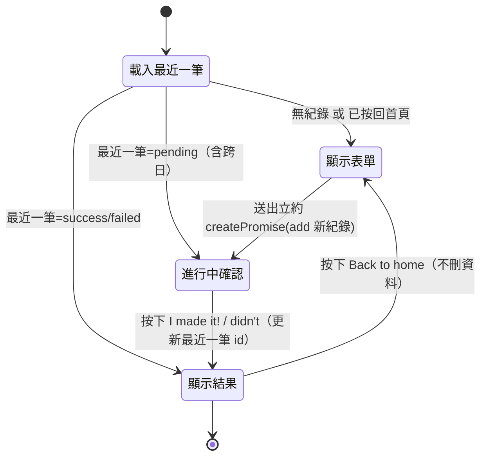
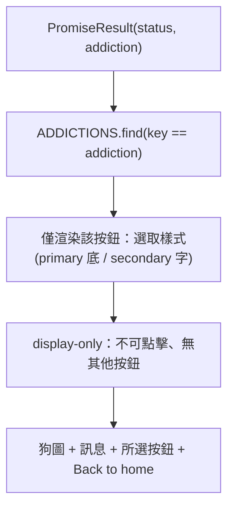
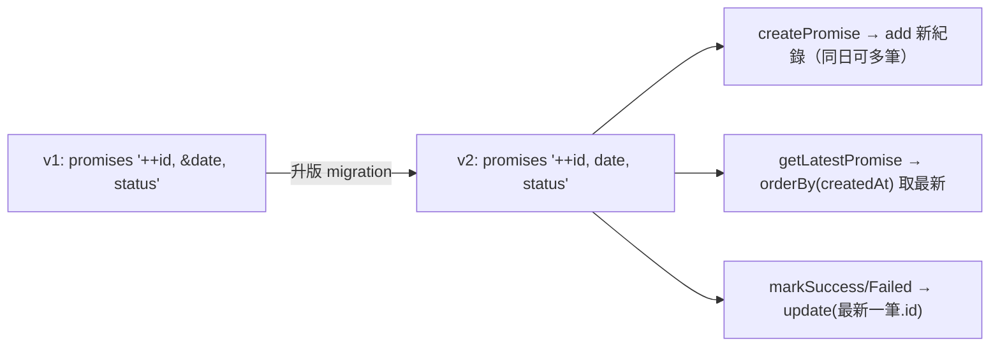

# 戒癮網站 - 跨日不重置與介面優化 (Promise Persistence & UI Refinement) PRD

**版本**：1.0
**建檔日期**：2026-06-28
**狀態**：待開發
**前置 PRD**：
- `docs/prd/done/promise-tracker-v1_20260621.md`（約定追蹤核心功能）
- `docs/prd/done/english-localization-v1_20260622.md`（介面英文化）
- `docs/prd/done/promise-ux-refinement-v1_20260622.md`（彩色單選按鈕 + 動態 placeholder）

**原始需求**：`docs/prd/done/20260623.md`

---

## 1. 目標與願景

### 目標
- **文案優化**：
  - 表單標題由 `What do you want to quit?` 改為 `Addiction Rehab Dog is expecting your promise`。
  - 約定輸入欄由單行 `input` 改為多行 `textarea`，方便輸入較長的約定內容。
- **結果頁顯示所選項目**：result 頁（success / failed）顯示使用者當初選取的成癮按鈕（**僅該按鈕、以選取樣式呈現、不可點擊**），其餘 6 個按鈕不顯示。
- **跨日不重置**：畫面改以「**最近一筆約定**」驅動（不再只查當天）。跨日後仍保留未確認的約定，讓使用者**親自確認是否達成**，確認後顯示「**回到首頁**」按鈕，由使用者自行返回首頁再立新約定。
- **允許一天多筆**：移除「一天一筆」限制，回到首頁後可立即再次立約（同日亦可），不再因 `date` unique 而丟錯。
- **客製化 favicon**：全新設計一個小尺寸辨識度佳的「狗頭」icon，置於 `src/app/icon.svg`，由 Next.js 自動產生 favicon。
- 維持 `npm test` 全綠，遵循 TDD（先紅後綠）。

### 願景
- **體驗願景**：約定不因午夜自動消失，使用者擁有「確認達成 → 主動回首頁 → 立新約」的完整節奏控制權，強化每日回訪與自我承諾的儀式感。
- **架構願景**：
  - 將「當天唯一」資料約束改為「**以最近一筆驅動 UI**」的查詢模型；狀態更新（success/failed）以**該筆 `id`** 為對象，而非以日期推導。
  - 視覺資產（favicon）採用 Next.js App Router 檔案約定（`src/app/icon.svg`），免手動維護 `<link>`。

### 本次範圍 / 非範圍
| 範圍 | 內容 |
|------|------|
| ✅ 本次範圍 | 表單標題文案、input→textarea、result 顯示所選按鈕、跨日不重置（最近一筆驅動）、回到首頁按鈕、允許一天多筆（移除 date unique + Dexie 升版）、狀態更新改以最近一筆、全新 favicon、同步受影響測試 |
| ❌ 非本次範圍 | 歷史紀錄清單 / 月曆檢視、連續達成統計（streak）、多個同時進行中的約定、深色模式色票細調、動畫過場、i18n、`describe`/`it` 測試敘述翻譯 |

---

## 2. 功能詳述

| # | 項目 | 說明 |
|---|------|------|
| 2.1 | 表單標題文案 | `PromiseForm.tsx` 的 `<legend>` 由 `What do you want to quit?` 改為 `Addiction Rehab Dog is expecting your promise`。 |
| 2.2 | input → textarea | 約定內容輸入由 `<input type="text">` 改為 `<textarea>`（多行、可換行）；保留 `value`/`onChange`/動態 placeholder/送出條件（trim 後非空）。 |
| 2.3 | result 顯示所選按鈕 | `PromiseResult` 新增 `addiction` prop；依該 key 從 `ADDICTIONS` 找出項目，**僅渲染該按鈕**並套用「選取中」樣式（primary 底 + secondary 字），**不可點擊（display-only）**；不渲染其餘按鈕。 |
| 2.4 | 最近一筆驅動 UI | 新增 `getLatestPromise()`：回傳**所有紀錄中最新的一筆**（依 `createdAt` 由新到舊，必要時以 `id` 為次序），與日期無關。`useTodayPromise` 改用之。 |
| 2.5 | 跨日不重置 | 移除「只查當天」邏輯。最近一筆若為 `pending`，跨日後仍持續顯示其確認介面，直到使用者按下達成 / 未達成。 |
| 2.6 | 狀態更新對象改為最近一筆 | `markSuccess` / `markFailed` 改以「最近一筆」的 `id` 更新（取代原本「以當天紀錄推導」）；無任何紀錄時丟錯。 |
| 2.7 | 回到首頁按鈕 | result 頁（success / failed）顯示「Back to home」按鈕。點擊後回到立約表單（不刪除既有紀錄）。 |
| 2.8 | 允許一天多筆 | Dexie schema `&date`（unique）改為 `date`（一般索引），並升版至 `version(2)` 進行 migration；`createPromise` 使用 `add` 新增一筆新紀錄（同日亦不衝突）。 |
| 2.9 | 全新 favicon | 設計 `src/app/icon.svg`（簡約狗頭、小尺寸高辨識），移除 / 取代既有預設 `src/app/favicon.ico`（避免兩者並存衝突）。 |
| 2.10 | pending 顯示文案微調 | 因可能顯示跨日的約定，`page.tsx` 進行中文案由 `Today's promise:` 改為 `Your promise:`（避免「Today's」誤導）。 |
| 2.11 | 測試同步更新 | 同步所有因資料模型（多筆 / 最近一筆）、文案、互動（textarea、回到首頁、result 顯示按鈕）改動而受影響的測試。 |

### 2.12 狀態與畫面對照（State → View）

| 狀態 | 條件 | 畫面 |
|------|------|------|
| Loading | `loading === true` | `Loading…` |
| 無紀錄 | 無任何約定 **或** 使用者按下「Back to home」 | `PromiseForm`（立約表單） |
| 進行中 | 最近一筆 `status === 'pending'` | 顯示約定內容 + `PromiseActions`（I made it! / I didn't make it...） |
| 已完成 | 最近一筆 `status === 'success' | 'failed'` 且未按回首頁 | `PromiseResult`（狗圖 + 訊息 + **所選按鈕** + **Back to home**） |

### 2.13 文案對照表（Canonical Text Mapping）

| 檔案 | 位置 | 現值 | 目標 |
|------|------|------|------|
| `PromiseForm.tsx` | `<legend>` | `What do you want to quit?` | `Addiction Rehab Dog is expecting your promise` |
| `page.tsx` | pending 顯示 | `Today's promise: {content}` | `Your promise: {content}` |
| `PromiseResult` | Back to home 按鈕 | （無） | `Back to home` |

### 2.14 受影響測試清單

| 測試檔 | 受影響斷言 / 常數 |
|--------|-------------------|
| `src/lib/promises/__tests__/repository.test.ts` | 移除「同日第二筆應丟錯」測試，改為「同日可建立多筆」；`getTodayPromise` → `getLatestPromise`（回傳最新一筆）；`markSuccess`/`markFailed` 以最近一筆為對象 |
| `src/components/__tests__/PromiseForm.test.tsx` | `<legend>` 文案斷言更新；輸入元素由 `input` 改 `textarea`（`getByRole('textbox')` 仍適用，但若以 placeholder/role 取得需確認）；動態 placeholder 斷言維持 |
| `src/components/__tests__/PromiseResult.test.tsx` | 新增 `addiction` prop；新增「僅顯示所選按鈕、其餘不顯示」斷言；新增 `Back to home` 按鈕與 `onBackHome` 回呼斷言；圖片 / 訊息斷言維持 |
| `src/app/__tests__/page.test.tsx` | pending 文案 `Your promise:`；result 區塊傳入 `addiction`；「Back to home」點擊回到表單的整合斷言 |
| `src/hooks/__tests__/useTodayPromise.test.tsx` | 改用 `getLatestPromise` mock；確認 `submit`/`markSuccess`/`markFailed` 後 refresh 行為不變 |

> `describe` / `it` 敘述屬內部規格，**非本次範圍**。

---

## 3. 業務邏輯圖

### 3.1 跨日不重置與回到首頁流程



### 3.2 結果頁所選按鈕渲染



### 3.3 資料模型變更（一天多筆）



---

## 4. 參考檔案路徑

| 路徑 | 說明 | 本次動作 |
|------|------|----------|
| `src/lib/db.ts` | Dexie schema | `&date` → `date`；新增 `version(2)` migration |
| `src/lib/promises/repository.ts` | 資料存取 | 新增 `getLatestPromise`；`createPromise` 改可同日多筆；`markSuccess`/`markFailed` 以最近一筆 `id` 更新 |
| `src/lib/promises/__tests__/repository.test.ts` | 倉儲測試 | 移除同日丟錯、改多筆；最近一筆查詢與狀態更新斷言 |
| `src/hooks/useTodayPromise.ts` | 取約定 hook | 改用 `getLatestPromise`（介面 `promise` 不變） |
| `src/hooks/__tests__/useTodayPromise.test.tsx` | hook 測試 | 同步 mock 函式名 |
| `src/components/PromiseForm.tsx` | 立約表單 | `<legend>` 文案；`input` → `textarea` |
| `src/components/__tests__/PromiseForm.test.tsx` | 表單測試 | 文案 + textarea 斷言 |
| `src/components/PromiseResult.tsx` | 結果回饋 | 新增 `addiction` + `onBackHome` props；渲染所選按鈕 + Back to home |
| `src/components/__tests__/PromiseResult.test.tsx` | 結果測試 | 所選按鈕 / Back to home 斷言 |
| `src/app/page.tsx` | 首頁整合 | pending 文案；result 傳 `addiction`；本地 `showForm` 狀態 + 回首頁邏輯 |
| `src/app/__tests__/page.test.tsx` | 首頁測試 | 整合斷言 |
| `src/app/icon.svg` | （新增）favicon | 全新狗頭 icon |
| `src/app/favicon.ico` | 現有預設 favicon | 移除 / 取代以避免衝突 |
| `src/constants/addictions.ts` | 成癮項目（含顏色） | 不變（result 按鈕沿用顏色資料） |

---

## 5. 範例程式碼

### 5.1 `db.ts`（升版至 v2，date 改非 unique）

```ts
this.version(1).stores({
  promises: '++id, &date, status',
});
// v2: 允許一天多筆 —— date 改為一般索引
this.version(2).stores({
  promises: '++id, date, status',
});
```

### 5.2 `repository.ts`（最近一筆 + 多筆 + 以 id 更新）

```ts
export async function getLatestPromise(): Promise<PromiseRecord | undefined> {
  // 取最新一筆（與日期無關）。createdAt 由新到舊，取第一筆。
  return db.promises.orderBy('createdAt').last();
}

export async function createPromise(input: {
  addiction: AddictionKey;
  content: string;
}): Promise<PromiseRecord> {
  const now = Date.now();
  const record: PromiseRecord = {
    date: getToday(),
    addiction: input.addiction,
    content: input.content,
    status: 'pending',
    createdAt: now,
    updatedAt: now,
  };
  const id = await db.promises.add(record); // 同日可多筆（date 非 unique）
  return { ...record, id };
}

async function setStatus(status: 'success' | 'failed'): Promise<void> {
  const latest = await getLatestPromise();
  if (!latest?.id) throw new Error('No promise exists; cannot update status.');
  await db.promises.update(latest.id, { status, updatedAt: Date.now() });
}

export const markSuccess = () => setStatus('success');
export const markFailed = () => setStatus('failed');
```

> 註：`createdAt` 需建立索引才能 `orderBy`，或改以 `++id` 主鍵排序（`db.promises.orderBy('id').last()`）。實作時擇一，建議用 `id`（自增、單調）最穩定。

### 5.3 `PromiseForm.tsx`（標題 + textarea）

```tsx
<legend className="mb-2 text-lg font-semibold">
  Addiction Rehab Dog is expecting your promise
</legend>
...
<textarea
  value={content}
  onChange={(event) => setContent(event.target.value)}
  placeholder={placeholder}
  rows={3}
  className="resize-y rounded border border-zinc-300 px-3 py-2 dark:border-zinc-700 dark:bg-zinc-900"
/>
```

### 5.4 `PromiseResult.tsx`（顯示所選按鈕 + Back to home）

```tsx
import Image from 'next/image';
import { ADDICTIONS, type AddictionKey } from '@/constants/addictions';

interface PromiseResultProps {
  status: 'success' | 'failed';
  addiction: AddictionKey;
  onBackHome: () => void;
}

export function PromiseResult({ status, addiction, onBackHome }: PromiseResultProps) {
  const { src, alt, message } = RESULT[status];
  const selected = ADDICTIONS.find((a) => a.key === addiction) ?? ADDICTIONS[0];

  return (
    <div className="flex flex-col items-center gap-4">
      <Image src={src} alt={alt} width={200} height={200} priority />
      <p className="text-xl font-semibold">{message}</p>

      {/* 僅顯示所選按鈕（選取樣式、不可點擊） */}
      <span
        className="rounded-lg border-2 px-4 py-3 text-sm font-medium"
        style={{ backgroundColor: selected.primary, color: selected.secondary, borderColor: selected.primary }}
      >
        {selected.label}
      </span>

      <button
        type="button"
        onClick={onBackHome}
        className="rounded-full bg-foreground px-5 py-3 font-medium text-background"
      >
        Back to home
      </button>
    </div>
  );
}
```

### 5.5 `page.tsx`（本地 showForm 控制回首頁）

```tsx
const { promise, loading, submit, markSuccess, markFailed } = useTodayPromise();
const [showForm, setShowForm] = useState(false);

const handleSubmit = async (input: { addiction: AddictionKey; content: string }) => {
  await submit(input);
  setShowForm(false);
};

// ...
{loading ? (
  <p className="text-zinc-500">Loading…</p>
) : showForm || !promise ? (
  <PromiseForm onSubmit={handleSubmit} />
) : promise.status === 'pending' ? (
  <>
    <p className="text-lg">Your promise: {promise.content}</p>
    <PromiseActions onSuccess={markSuccess} onFailed={markFailed} />
  </>
) : (
  <PromiseResult
    status={promise.status}
    addiction={promise.addiction}
    onBackHome={() => setShowForm(true)}
  />
)}
```

### 5.6 TDD 範例：result 僅顯示所選按鈕（先紅後綠）

```tsx
it('should show only the selected addiction button on the result page', () => {
  render(<PromiseResult status="success" addiction="youtube-shorts" onBackHome={jest.fn()} />);

  expect(screen.getByText('YouTube Shorts')).toBeInTheDocument();
  expect(screen.queryByText('Instagram Reels')).not.toBeInTheDocument();
});

it('should call onBackHome when the back button is clicked', async () => {
  const onBackHome = jest.fn();
  const user = userEvent.setup();
  render(<PromiseResult status="failed" addiction="x" onBackHome={onBackHome} />);

  await user.click(screen.getByRole('button', { name: 'Back to home' }));

  expect(onBackHome).toHaveBeenCalledTimes(1);
});
```

### 5.7 TDD 範例：同日可建立多筆（先紅後綠）

```ts
it('should allow creating multiple promises on the same day', async () => {
  await createPromise({ addiction: TEST_CONSTANTS.ADDICTION, content: 'first' });
  await createPromise({ addiction: TEST_CONSTANTS.ADDICTION, content: 'second' });

  const count = await db.promises.count();
  expect(count).toBe(2);
});

it('getLatestPromise should return the most recently created promise', async () => {
  await createPromise({ addiction: TEST_CONSTANTS.ADDICTION, content: 'first' });
  await createPromise({ addiction: TEST_CONSTANTS.ADDICTION, content: 'second' });

  const latest = await getLatestPromise();
  expect(latest?.content).toBe('second');
});
```

---

## 6. 驗證項目

### 6.1 單元測試
- `npm test` → 全數通過。
- 新增 / 更新涵蓋：
  - `createPromise` 同日可多筆；`getLatestPromise` 回傳最新一筆。
  - `markSuccess` / `markFailed` 更新最近一筆狀態；無紀錄時丟錯。
  - `PromiseForm` 標題為新文案；輸入元素為 `textarea`。
  - `PromiseResult` 僅顯示所選按鈕、其餘不顯示；`Back to home` 觸發 `onBackHome`。
  - `page` pending 顯示 `Your promise:`；點 Back to home 後回到表單。

### 6.2 執行 / 建置驗證
- `npm run typecheck` → 無型別錯誤（`PromiseResult` 新 props、`getLatestPromise` 型別正確）。
- `npm run build` → 建置成功（含 `src/app/icon.svg` 被識別為 favicon）。
- `npm run lint` → 無新增錯誤。

### 6.3 瀏覽器內驗證（`npm run dev`）
- 表單標題顯示 `Addiction Rehab Dog is expecting your promise`；輸入欄為可換行 textarea。
- 立約後（pending）跨日（可手動改裝置日期 / 或隔日）重新整理 → **仍顯示該約定的確認介面，未重置為新表單**。
- 按 I made it! / didn't → result 顯示狗圖 + 訊息 + **僅所選 app 按鈕**（選取色）+ Back to home。
- 按 Back to home → 回到立約表單；再次送出（同日）→ 成功建立新約定，無錯誤。
- 瀏覽器分頁顯示全新狗頭 favicon。

### 6.4 無障礙
- textarea 可鍵盤輸入與聚焦；Back to home 按鈕可鍵盤操作。
- result 所選按鈕為純展示（非互動）；不干擾鍵盤焦點順序。

---

## 7. 開發任務清單 (TODO)

> 原則：每項任務 ≤ 1 天。資料模型 / user-facing 字串 / 互動依 TDD「先改測試（RED）→ 再改原始碼（GREEN）」。

| # | 任務 | 預估 | 依賴 | 驗證 |
|---|------|------|------|------|
| 1 | `db.ts`：`&date` → `date`，新增 `version(2)` migration（允許一天多筆） | 0.3h | - | `npm run typecheck` 綠；既有資料可載入不報錯 |
| 2 | `repository.ts`：新增 `getLatestPromise`（取最新一筆）；`createPromise` 改同日可多筆；同步改寫 `repository.test.ts`（移除同日丟錯、改多筆 + 最近一筆）（先紅後綠） | 0.6h | 1 | `repository.test.ts` 通過 |
| 3 | `repository.ts`：`markSuccess`/`markFailed` 改以最近一筆 `id` 更新；同步測試（先紅後綠） | 0.4h | 2 | 狀態更新 / 無紀錄丟錯測試通過 |
| 4 | `useTodayPromise.ts`：改用 `getLatestPromise`；同步 `useTodayPromise.test.tsx` mock（先紅後綠） | 0.3h | 2 | `useTodayPromise.test.tsx` 通過 |
| 5 | `PromiseForm.tsx`：`<legend>` 改新文案；`input` → `textarea`；同步 `PromiseForm.test.tsx`（先紅後綠） | 0.4h | - | `PromiseForm.test.tsx` 通過 |
| 6 | `PromiseResult.tsx`：新增 `addiction` prop，僅渲染所選按鈕（選取樣式、不可點擊），其餘不顯示；同步 `PromiseResult.test.tsx`（先紅後綠） | 0.5h | - | result 僅顯示所選按鈕測試通過 |
| 7 | `PromiseResult.tsx`：新增 `onBackHome` + `Back to home` 按鈕；同步測試（先紅後綠） | 0.3h | 6 | Back to home 回呼測試通過 |
| 8 | `page.tsx`：pending 文案 `Your promise:`；result 傳 `addiction`；新增 `showForm` 狀態與回首頁 / 重新立約邏輯；同步 `page.test.tsx`（先紅後綠） | 0.6h | 4,7 | `page.test.tsx` 整合測試通過 |
| 9 | 新增 `src/app/icon.svg`（全新狗頭 favicon）；移除 / 取代 `src/app/favicon.ico` 以免衝突 | 0.5h | - | `npm run build` 綠；瀏覽器分頁顯示新 favicon |
| 10 | 全域驗收：`npm test` / `npm run typecheck` / `npm run build` / `npm run lint` 全綠 + 6.3/6.4 瀏覽器與無障礙驗證 | 0.3h | 1–9 | 6.1〜6.4 全數通過 |

---

## 附錄：設計備註

- **最近一筆的判定**：建議以自增主鍵 `id`（`orderBy('id').last()`）作為「最新」依據，最單調穩定；若用 `createdAt` 排序需為其建立索引。實作時二擇一並於 PR 註明。
- **Dexie migration**：`&date` → `date` 屬索引定義變更，需升版 `version(2)`；既有使用者本機 IndexedDB 會自動套用新 schema，現有資料保留。
- **favicon 衝突**：Next.js App Router 同時存在 `favicon.ico` 與 `icon.svg` 時，`favicon.ico` 優先。為確保新 icon 生效，需移除既有 `src/app/favicon.ico`（或直接以新設計覆蓋之）。
- **回到首頁的語意**：Back to home 僅切換 UI（本地 `showForm`），**不刪除任何歷史紀錄**；再次送出即新增下一筆，天然支援未來的歷史紀錄功能。
- **pending 跨日顯示**：目前進行中介面不特別標示約定日期；若日後需顯示「這是哪一天的約定」，可另立任務在 pending 區塊顯示 `promise.date`。
