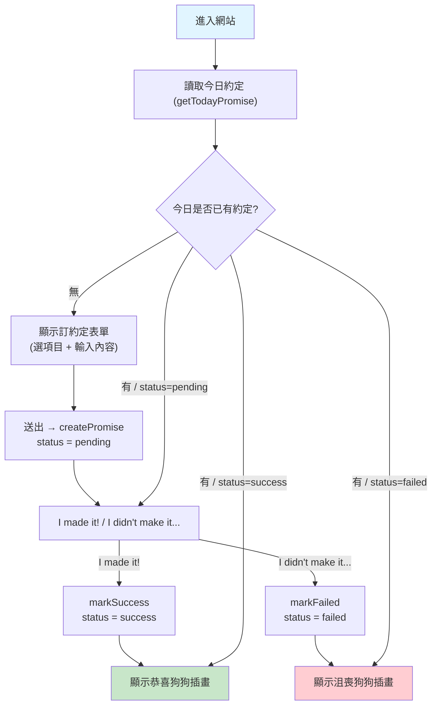
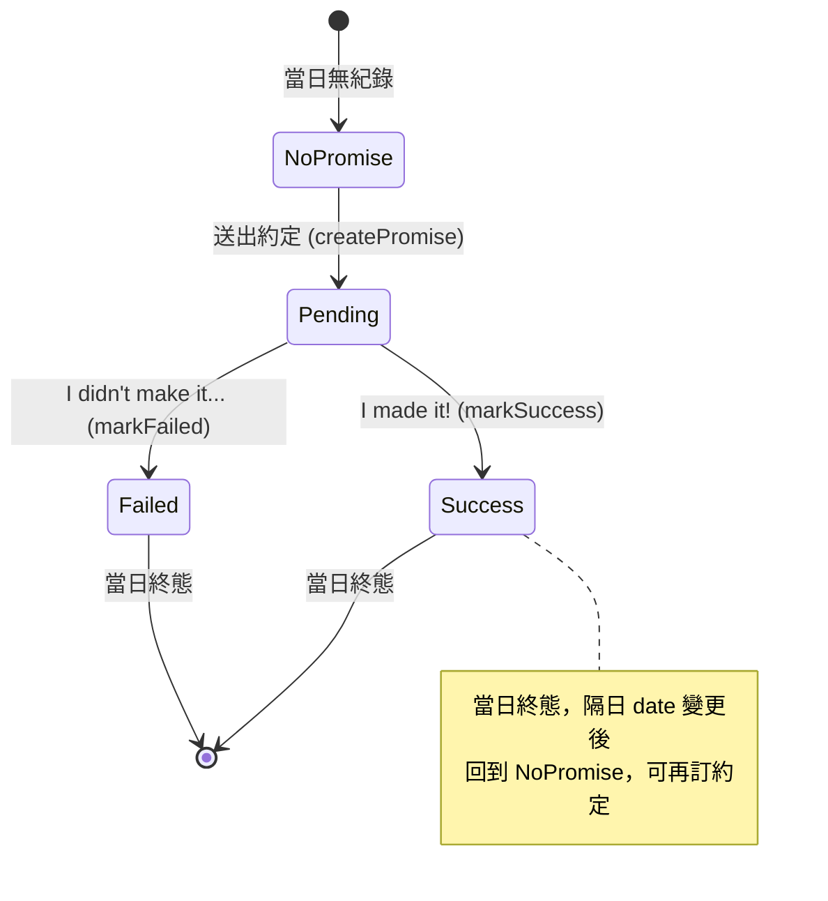

# 戒癮網站 - 約定追蹤 (Promise Tracker) PRD

**版本**：1.0
**建檔日期**：2026-06-21
**狀態**：待開發
**前置 PRD**：`docs/prd/done/init-project_20260620.md`（專案初始化已完成）

---

## 1. 目標與願景

### 目標
- 讓使用者進入網站後，從固定的成癮項目（social media）中選擇想戒除的目標，並對自己訂下一個每日約定。
- 約定送出後，介面切換為「I made it!」/「I didn't make it...」兩個按鈕，記錄當日是否遵守。
- 成功 / 失敗以狗狗主題插畫給予即時回饋（恭喜 / 沮喪）。
- 所有約定與結果資料儲存在瀏覽器 IndexedDB（透過 Dexie），離線可用、無需後端。

### 願景
- **技術願景**：以 Next.js 16 App Router + React 19 + Dexie，打造純前端、可離線運作的 PWA-ready 體驗。
- **資料願景**：以「每日一筆」的結構化紀錄為基礎，未來可在不改動資料模型的前提下擴充圖表統計（成功天數、連續成功 streak）。
- **開發流程願景**：嚴格遵循 TDD（Red → Green → Refactor），repository 與元件皆先寫測試；以 `fake-indexeddb` 隔離 I/O，測試快速可重複。

### 本次範圍 / 非範圍
| 範圍 | 內容 |
|------|------|
| ✅ 本次範圍 | 選擇成癮項目、輸入約定內容、送出儲存、成功/失敗按鈕與紀錄、狗狗插畫回饋、每日一筆約束、Dexie 持久化 |
| ❌ 非本次範圍 | 圖表 / 統計頁面、連續成功天數計算、後端 API 與雲端同步、使用者帳號、約定項目的動態擴充（目前寫死） |

---

## 2. 功能詳述

| # | 功能 | 說明 |
|---|------|------|
| 2.1 | 成癮項目選擇 | 從寫死的固定清單選擇一個項目（ig reels、fb 短影片、yt shorts、threads、X、reddit、ptt）。項目以常數定義，未來可擴充。 |
| 2.2 | 訂下約定表單 | 選定項目後，提供文字 input 讓使用者自由輸入約定內容（例：「我今天完全不開啟 IG 滑短影音」）。送出後寫入 IndexedDB。 |
| 2.3 | 每日一筆約束 | 同一天（本機日期 `YYYY-MM-DD`）只允許一筆約定。當日已有約定時不顯示表單，改顯示遵守/失敗操作或結果。 |
| 2.4 | 遵守約定操作 | 當日約定為進行中（pending）時，隱藏表單，顯示「I made it!」與「I didn't make it...」兩個按鈕。 |
| 2.5 | 成功回饋 | 按下「I made it!」→ 狀態更新為 success，寫入 IndexedDB，顯示恭喜的狗狗插畫。 |
| 2.6 | 失敗回饋 | 按下「I didn't make it...」→ 狀態更新為 failed，寫入 IndexedDB，顯示沮喪的狗狗插畫。 |
| 2.7 | 狀態還原 | 重新整理或再次進入網站時，依今日紀錄還原畫面（無約定→表單；pending→按鈕；success/failed→結果插畫）。 |
| 2.8 | 資料持久層 (Dexie) | 以 Dexie 封裝 IndexedDB，提供 repository（取得今日約定、建立約定、標記成功、標記失敗）。 |

### 2.9 成癮項目清單（寫死）

| key | label |
|-----|-------|
| `instagram-reels` | Instagram Reels |
| `facebook-reels` | Facebook 短影片 |
| `youtube-shorts` | YouTube Shorts |
| `threads` | Threads |
| `x` | X |
| `reddit` | Reddit |
| `ptt` | PTT |

### 2.10 資料模型（Dexie table: `promises`）

| 欄位 | 型別 | 說明 |
|------|------|------|
| `id` | number (auto increment, PK) | 自動主鍵 |
| `date` | string `YYYY-MM-DD`（**unique index**） | 本機日期，強制每日一筆 |
| `addiction` | string | 成癮項目 key（對應 2.9） |
| `content` | string | 使用者輸入的約定內容 |
| `status` | `'pending' \| 'success' \| 'failed'` | 約定狀態 |
| `createdAt` | number (epoch ms) | 建立時間 |
| `updatedAt` | number (epoch ms) | 最後更新時間 |

> 未來圖表需求僅需讀取 `date` 與 `status`，無須改動此結構。

---

## 3. 業務邏輯圖

### 3.1 主流程



### 3.2 約定狀態機



---

## 4. 參考檔案路徑

```
src/
├── app/
│   ├── page.tsx                         # 首頁：依今日約定狀態切換顯示
│   └── __tests__/page.test.tsx          # 既有，將更新
├── constants/
│   └── addictions.ts                    # 2.9 寫死的成癮項目清單與型別
├── lib/
│   ├── db.ts                            # Dexie 實例與 schema
│   ├── date.ts                          # getToday() → YYYY-MM-DD（本機）
│   └── promises/
│       ├── repository.ts                # CRUD：getTodayPromise / createPromise / markSuccess / markFailed
│       ├── types.ts                     # Promise 紀錄型別、PromiseStatus
│       └── __tests__/repository.test.ts # Dexie repository 測試（fake-indexeddb）
├── hooks/
│   ├── useTodayPromise.ts               # 載入/操作今日約定的 hook
│   └── __tests__/useTodayPromise.test.tsx
└── components/
    ├── PromiseForm.tsx                  # 2.1 + 2.2 選項目 + 輸入 + 送出
    ├── PromiseActions.tsx               # 2.4 兩個按鈕
    ├── PromiseResult.tsx                # 2.5 + 2.6 狗狗插畫結果
    └── __tests__/                       # 各元件測試

public/
└── dog/
    ├── happy-dog.svg                    # 成功插畫（可先用 placeholder）
    └── sad-dog.svg                      # 失敗插畫（可先用 placeholder）
```

---

## 5. 範例程式碼

### 5.1 成癮項目常數 (`src/constants/addictions.ts`)
```ts
export const ADDICTIONS = [
  { key: 'instagram-reels', label: 'Instagram Reels' },
  { key: 'facebook-reels', label: 'Facebook 短影片' },
  { key: 'youtube-shorts', label: 'YouTube Shorts' },
  { key: 'threads', label: 'Threads' },
  { key: 'x', label: 'X' },
  { key: 'reddit', label: 'Reddit' },
  { key: 'ptt', label: 'PTT' },
] as const;

export type AddictionKey = (typeof ADDICTIONS)[number]['key'];
```

### 5.2 Dexie 實例與 schema (`src/lib/db.ts`)
```ts
import Dexie, { type Table } from 'dexie';
import type { PromiseRecord } from '@/lib/promises/types';

export class AppDatabase extends Dexie {
  promises!: Table<PromiseRecord, number>;

  constructor() {
    super('addiction-rehab-dog');
    // &date：date 為 unique index，落實「每日一筆」
    this.version(1).stores({
      promises: '++id, &date, status',
    });
  }
}

export const db = new AppDatabase();
```

### 5.3 型別 (`src/lib/promises/types.ts`)
```ts
import type { AddictionKey } from '@/constants/addictions';

export type PromiseStatus = 'pending' | 'success' | 'failed';

export interface PromiseRecord {
  id?: number;
  date: string; // YYYY-MM-DD
  addiction: AddictionKey;
  content: string;
  status: PromiseStatus;
  createdAt: number;
  updatedAt: number;
}
```

### 5.4 Repository (`src/lib/promises/repository.ts`)
```ts
import { db } from '@/lib/db';
import { getToday } from '@/lib/date';
import type { AddictionKey } from '@/constants/addictions';
import type { PromiseRecord } from './types';

export async function getTodayPromise(): Promise<PromiseRecord | undefined> {
  return db.promises.where('date').equals(getToday()).first();
}

export async function createPromise(input: {
  addiction: AddictionKey;
  content: string;
}): Promise<PromiseRecord> {
  const now = Date.now();
  const record: PromiseRecord = {
    date: getToday(),
    addiction: input.addiction,
    content: input.content,
    status: 'pending',
    createdAt: now,
    updatedAt: now,
  };
  const id = await db.promises.add(record); // date unique → 同日重複會 throw
  return { ...record, id };
}

async function setStatus(status: 'success' | 'failed'): Promise<void> {
  const today = await getTodayPromise();
  if (!today?.id) throw new Error('今日尚無約定，無法更新狀態');
  await db.promises.update(today.id, { status, updatedAt: Date.now() });
}

export const markSuccess = () => setStatus('success');
export const markFailed = () => setStatus('failed');
```

### 5.5 日期工具 (`src/lib/date.ts`)
```ts
// 以本機時區回傳 YYYY-MM-DD
export function getToday(date = new Date()): string {
  const y = date.getFullYear();
  const m = String(date.getMonth() + 1).padStart(2, '0');
  const d = String(date.getDate()).padStart(2, '0');
  return `${y}-${m}-${d}`;
}
```

### 5.6 Repository 測試骨架（TDD 範例，`fake-indexeddb`）
```ts
import 'fake-indexeddb/auto';

const TEST_CONSTANTS = {
  ADDICTION: 'instagram-reels' as const,
  CONTENT: '我今天完全不開啟 IG 滑短影音',
};

describe('Promise Repository', () => {
  beforeEach(async () => {
    const { db } = await import('@/lib/db');
    await db.promises.clear();
  });

  describe('Success Cases', () => {
    it('should create today promise with pending status', async () => {
      const { createPromise } = await import('@/lib/promises/repository');
      const result = await createPromise({
        addiction: TEST_CONSTANTS.ADDICTION,
        content: TEST_CONSTANTS.CONTENT,
      });
      expect(result.status).toBe('pending');
    });
  });

  describe('Error Cases', () => {
    it('should reject a second promise on the same day', async () => {
      const { createPromise } = await import('@/lib/promises/repository');
      await createPromise({ addiction: TEST_CONSTANTS.ADDICTION, content: TEST_CONSTANTS.CONTENT });
      await expect(
        createPromise({ addiction: TEST_CONSTANTS.ADDICTION, content: TEST_CONSTANTS.CONTENT }),
      ).rejects.toThrow();
    });
  });
});
```

> 註：`jest.setup.ts` 可加入 `import 'fake-indexeddb/auto';`，讓所有測試共用 IndexedDB polyfill。

---

## 6. 驗證項目

### 單元測試（`npm test`）
- [ ] `repository.test.ts`：
  - 成功建立今日約定（status=pending）
  - 同日重複建立 → 拋錯（每日一筆）
  - `getTodayPromise` 正確回傳/回傳 undefined
  - `markSuccess` / `markFailed` 正確更新 status 與 updatedAt
  - 無今日約定時呼叫 markSuccess/markFailed → 拋錯
- [ ] `date.test.ts`：`getToday` 對給定日期回傳正確 `YYYY-MM-DD`（含補零）
- [ ] `useTodayPromise.test.tsx`：載入今日狀態、送出後轉 pending、成功/失敗後轉對應狀態
- [ ] 元件測試：
  - `PromiseForm`：渲染所有成癮項目、輸入內容、送出觸發 callback；內容為空時不可送出
  - `PromiseActions`：渲染兩個按鈕、點擊觸發對應 callback
  - `PromiseResult`：success 顯示 happy-dog、failed 顯示 sad-dog

### 執行驗證
- [ ] `npm run build` 成功編譯，無錯誤
- [ ] `npm run lint` 無錯誤
- [ ] `npm run typecheck`（`tsc --noEmit`）無錯誤

### 遊戲內 / 瀏覽器手動驗證
- [ ] 首次進入：顯示項目選擇 + 約定輸入表單
- [ ] 送出約定後：表單消失，出現「I made it!」「I didn't make it...」兩按鈕
- [ ] 按「I made it!」：出現恭喜狗狗插畫
- [ ] 按「I didn't make it...」：出現沮喪狗狗插畫
- [ ] 重新整理頁面：畫面依今日紀錄正確還原（不會回到表單）
- [ ] DevTools → Application → IndexedDB → `addiction-rehab-dog` → `promises` 可見當日紀錄與 status

---

## 7. 開發任務清單 (TODO)

### 任務劃分原則
- 每個任務 ≤ 1 天（4–6 小時），嚴格遵循 TDD（先寫失敗測試 → 最小實作 → 重構）。
- 基礎優先：先建持久層與常數，再做 hook 與 UI。

| # | 任務 | 預估 | 依賴 | 驗證項目 |
|---|------|------|------|---------|
| T1 | 安裝相依套件（`dexie`、`fake-indexeddb`），於 `jest.setup.ts` 引入 polyfill | 0.5h | - | `npm test` 可載入 IndexedDB；既有測試仍通過 |
| T2 | 建立成癮項目常數與型別 `constants/addictions.ts`、`lib/promises/types.ts` | 0.5h | - | `npm run typecheck` 無錯誤 |
| T3 | 日期工具 `lib/date.ts`（TDD：`getToday`） | 0.5h | T1 | `date.test.ts` 綠燈（含補零案例） |
| T4 | Dexie 實例與 schema `lib/db.ts`（`&date` unique index） | 0.5h | T1,T2 | DB 可初始化，schema 含 promises 表 |
| T5 | Promise repository `lib/promises/repository.ts`（TDD：create/getToday/markSuccess/markFailed + 每日一筆） | 2h | T2,T3,T4 | `repository.test.ts` 全綠（含同日重複拋錯） |
| T6 | `useTodayPromise` hook（載入今日狀態 + 操作）（TDD） | 1.5h | T5 | `useTodayPromise.test.tsx` 綠燈 |
| T7 | `PromiseForm` 元件（選項目 + 輸入 + 送出）（TDD） | 1.5h | T2 | `PromiseForm` 測試綠燈；空內容不可送出 |
| T8 | `PromiseActions` 元件（兩個按鈕）（TDD） | 1h | - | `PromiseActions` 測試綠燈 |
| T9 | 準備並放置狗狗插畫資源 `public/dog/happy-dog.svg`、`sad-dog.svg`（可先用 placeholder） | 0.5h | - | 檔案存在，可被 `next/image` 載入 |
| T10 | `PromiseResult` 元件（success/failed 顯示對應狗狗插畫）（TDD） | 1h | T9 | `PromiseResult` 測試綠燈 |
| T11 | 組合 `app/page.tsx`：依今日約定狀態切換 表單 / 按鈕 / 結果 | 1.5h | T6,T7,T8,T10 | `page.test.tsx` 更新並綠燈 |
| T12 | 整合驗證：build / lint / typecheck + 瀏覽器手動驗證（§6） | 1h | T1-T11 | §6 全部驗證項目通過 |

**預計總工時**：約 12.5 小時（約 2 個工作天）

---

## 附錄：後續工作（非本次範圍）
1. **統計圖表頁**：以 `date` + `status` 計算成功率、月曆熱力圖、連續成功 streak。
2. **後端 API 與雲端同步**：將 IndexedDB 資料同步至伺服器，跨裝置可用。
3. **約定項目擴充**：將寫死清單改為可設定 / 動態載入。
4. **更彈性的約定型態**：時數上限、與昨日比較等量化目標與驗證。

---

**核准者**：待確認
**最後更新**：2026-06-21
