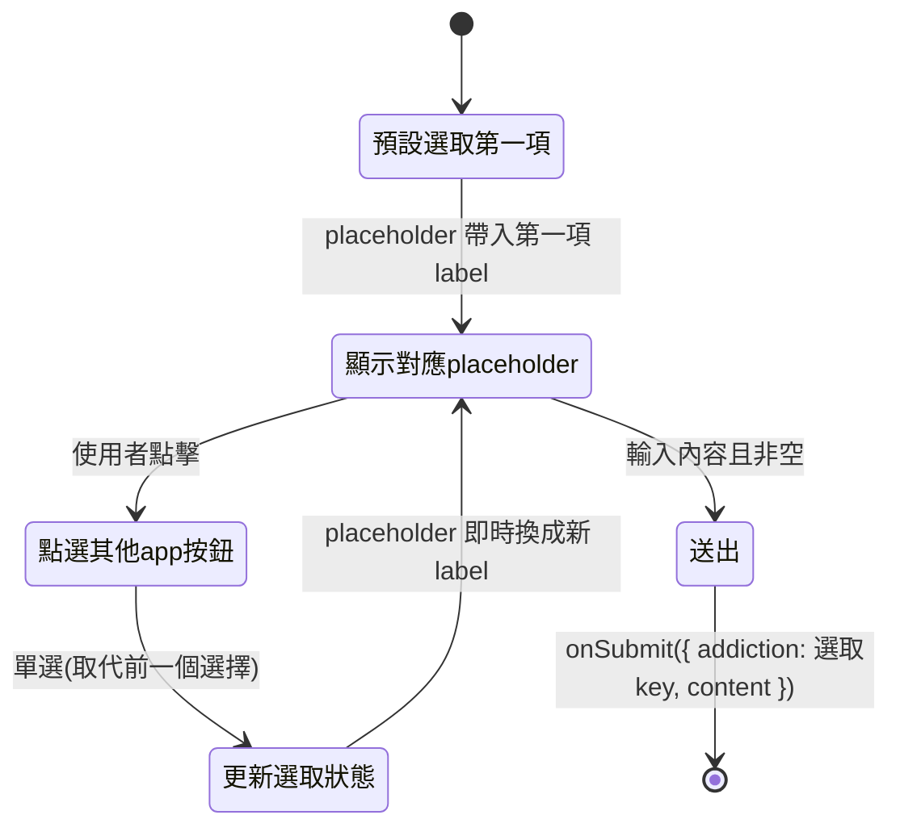
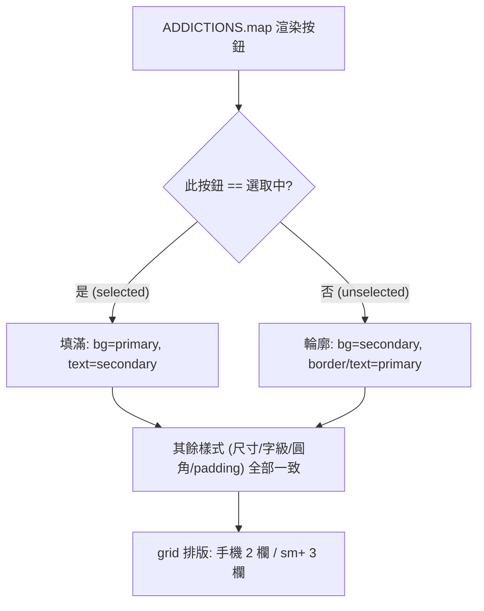

# 戒癮網站 - 約定表單 UX 優化 (Promise UX Refinement) PRD

**版本**：1.0
**建檔日期**：2026-06-22
**狀態**：待開發
**前置 PRD**：
- `docs/prd/done/promise-tracker-v1_20260621.md`（約定追蹤功能已完成）
- `docs/prd/done/english-localization-v1_20260622.md`（介面已英文化）

**原始需求**：`docs/prd/20260622-2.md`

---

## 1. 目標與願景

### 目標
- **文案優化**：調整 promise form 的 placeholder 與 promise result 的成功 / 失敗訊息，讓引導語更明確、回饋語更具陪伴感（AR Dog 擬人化）。
- **動態 placeholder**：placeholder 文字會**隨選取的 app 按鈕即時變更**，把所選 app 名稱帶入引導句。
- **客製化按鈕**：將成癮項目的選取方式由原生 `radio` 改為**客製化單選按鈕**，每個 app 有**專屬配色（primary + secondary）**，使用者**單靠顏色即可辨識**是哪一個 app。
- **版面易讀**：調整按鈕排列方式（grid），提升閱讀與選取的容易度。
- 維持 `npm test` 全綠，遵循 TDD（先紅後綠）。

### 願景
- **體驗願景**：以「與 AR Dog 立約」的擬人化情感連結強化每日回訪動機（success 訊息預告明日、failed 訊息給予擁抱）。
- **架構願景**：將每個 app 的**視覺識別（顏色）視為資料**，集中定義於 `addictions.ts`，與 `key` / `label` 並列；元件僅依資料渲染，新增 app 時只需擴充常數。
- **配色策略（本次採用）**：**品牌色為主 + 去撞色**——盡量貼近各 app 品牌色，但對撞色者（Threads 黑 / X 黑 / Instagram 漸層）改用可區分的純色，確保 7 色彼此可辨。

### 本次範圍 / 非範圍
| 範圍 | 內容 |
|------|------|
| ✅ 本次範圍 | placeholder 文案 + 動態化、result 成功/失敗訊息、客製化單選按鈕、每 app 專屬配色（資料化）、按鈕 grid 排版、同步受影響測試 |
| ❌ 非本次範圍 | 多選 / 複數約定、新增成癮項目、深色模式專屬配色細調、動畫 / 過場效果、i18n、`describe`/`it` 測試敘述翻譯 |

---

## 2. 功能詳述

| # | 項目 | 說明 |
|---|------|------|
| 2.1 | placeholder 文案調整 | 由 `e.g. I won't open Instagram Reels at all today` 改為 `e.g. I will do ____ (something) instead of opening {app} today` 句型。 |
| 2.2 | placeholder 動態化 | placeholder 中的 `{app}` 隨選取的按鈕即時替換為該 app 的 `label`（無選取時預設第一個）。 |
| 2.3 | success 訊息調整 | 由 `Awesome, you made it today! 🎉` 改為 `Awesome, you made it today! 🎉 AR Dog Can't wait to see you tomorrow! 🎉`。 |
| 2.4 | failed 訊息調整 | 由 `It's okay — try again tomorrow…` 改為 `AR Dog gives you a hug. AR Dog expects to see you tomorrow.`。 |
| 2.5 | 客製化單選按鈕 | 以 `<button>`（或可點 `label`）取代原生 `radio`；**每次只能選一個**；保留鍵盤可達性與被選取狀態（`aria-pressed` / `aria-checked`）。 |
| 2.6 | 每 app 專屬配色（資料化） | 在 `addictions.ts` 為每個項目新增 `primary` / `secondary` 顏色；按鈕除顏色外**樣式完全一致**（尺寸、字級、圓角、padding 相同）。 |
| 2.7 | 選取狀態視覺 | 未選取：以該 app 顏色呈現可辨識樣式（如 secondary 底 + primary 邊框/文字）；選取中：primary 底 + secondary 文字（實心填滿），明確標示當前選擇。 |
| 2.8 | 按鈕排列調整 | 由垂直清單改為**responsive grid**（手機 2 欄、`sm` 以上 3 欄），提升掃視與選取效率。 |
| 2.9 | 測試同步更新 | 更新因 2.1〜2.4 字串改動、2.5 互動方式改動而受影響的測試斷言，維持全綠。 |

### 2.10 配色對照表（Canonical Color Mapping）

> 策略：品牌色為主 + 去撞色。`primary` 為選取時填滿底色，`secondary` 為其上文字色；未選取時對調運用（見 2.7）。
> 以下為建議值，實作時以此為準；如需微調色票請於實作前確認。

| key | label | primary（底） | secondary（字） | 說明 |
|-----|-------|--------------|----------------|------|
| `instagram-reels` | Instagram Reels | `#E1306C`（洋紅） | `#FFFFFF` | IG 為漸層，取代表性洋紅純色 |
| `facebook-reels` | Facebook Reels | `#1877F2`（藍） | `#FFFFFF` | 品牌藍 |
| `youtube-shorts` | YouTube Shorts | `#FF0000`（紅） | `#FFFFFF` | 品牌紅 |
| `threads` | Threads | `#000000`（黑） | `#FFFFFF` | 品牌黑 |
| `x` | X | `#536471`（灰） | `#FFFFFF` | X 亦為黑，去撞色改用 X 次要灰 |
| `reddit` | Reddit | `#FF4500`（橘） | `#FFFFFF` | 品牌橘 |
| `ptt` | PTT | `#2E7D32`（綠） | `#FFFFFF` | 終端機綠，與上述 6 色皆可辨 |

> 撞色去除重點：Threads 與 X 皆偏黑 → X 改用品牌次要灰 `#536471`；IG 漸層 → 取洋紅純色。7 色色相（洋紅 / 藍 / 紅 / 黑 / 灰 / 橘 / 綠）彼此可單獨辨識。

### 2.11 文案對照表（Canonical Text Mapping）

| 檔案 | 位置 | 現值 | 目標 |
|------|------|------|------|
| `PromiseForm.tsx` | `placeholder` | `e.g. I won't open Instagram Reels at all today` | `e.g. I will do ____ (something) instead of opening {app} today`（`{app}` = 選取項 `label`） |
| `PromiseResult.tsx` | success `message` | `Awesome, you made it today! 🎉` | `Awesome, you made it today! 🎉 AR Dog Can't wait to see you tomorrow! 🎉` |
| `PromiseResult.tsx` | failed `message` | `It's okay — try again tomorrow…` | `AR Dog gives you a hug. AR Dog expects to see you tomorrow.` |

### 2.12 受影響測試清單

| 測試檔 | 受影響斷言 / 常數 |
|--------|-------------------|
| `src/components/__tests__/PromiseForm.test.tsx` | 選取互動由 `radio` 改為 button：選取應改以 `getByRole('button', { name })` 或 `aria-pressed`；新增 placeholder 動態變更斷言；`onSubmit` 帶選取 `key` 的斷言維持 |
| `src/components/__tests__/PromiseResult.test.tsx` | 若斷言 message 文字需同步為新文案；圖片斷言不變 |
| `src/constants/__tests__/addictions.test.ts`（新增，若採資料測試） | 驗證每個項目皆具備 `primary` / `secondary`、且顏色彼此不重複 |
| `src/app/__tests__/page.test.tsx` | 若以 placeholder 或選項互動方式斷言需同步（確認即可） |

> `describe` / `it` 敘述屬內部規格，**非本次範圍**。

---

## 3. 業務邏輯圖

### 3.1 動態 placeholder 與單選互動



### 3.2 按鈕渲染與選取樣式決策



---

## 4. 參考檔案路徑

| 路徑 | 說明 | 本次動作 |
|------|------|----------|
| `src/constants/addictions.ts` | 成癮項目清單 | 為每項新增 `primary` / `secondary` 顏色（`key` / `label` 不動） |
| `src/components/PromiseForm.tsx` | 訂約定表單 | radio → 客製化單選按鈕、grid 排版、動態 placeholder |
| `src/components/PromiseResult.tsx` | 成功 / 失敗回饋 | 更新 success / failed `message` |
| `src/components/__tests__/PromiseForm.test.tsx` | 表單測試 | 同步互動方式、新增動態 placeholder 斷言 |
| `src/components/__tests__/PromiseResult.test.tsx` | 結果測試 | 同步 message 斷言（如有） |
| `src/constants/__tests__/addictions.test.ts` | （新增）常數測試 | 驗證顏色齊備且不重複 |
| `src/app/page.tsx` / `src/app/__tests__/page.test.tsx` | 首頁整合 | 確認整合無破壞（預期不動或微調） |

---

## 5. 範例程式碼

### 5.1 `addictions.ts`（新增顏色欄位，key/label 不變）

```ts
export const ADDICTIONS = [
  { key: 'instagram-reels', label: 'Instagram Reels', primary: '#E1306C', secondary: '#FFFFFF' },
  { key: 'facebook-reels', label: 'Facebook Reels', primary: '#1877F2', secondary: '#FFFFFF' },
  { key: 'youtube-shorts', label: 'YouTube Shorts', primary: '#FF0000', secondary: '#FFFFFF' },
  { key: 'threads', label: 'Threads', primary: '#000000', secondary: '#FFFFFF' },
  { key: 'x', label: 'X', primary: '#536471', secondary: '#FFFFFF' },
  { key: 'reddit', label: 'Reddit', primary: '#FF4500', secondary: '#FFFFFF' },
  { key: 'ptt', label: 'PTT', primary: '#2E7D32', secondary: '#FFFFFF' },
] as const;

export type AddictionKey = (typeof ADDICTIONS)[number]['key'];
```

### 5.2 動態 placeholder（依選取 label）

```tsx
const selected = ADDICTIONS.find((a) => a.key === addiction) ?? ADDICTIONS[0];
const placeholder = `e.g. I will do ____ (something) instead of opening ${selected.label} today`;

<input
  type="text"
  value={content}
  onChange={(e) => setContent(e.target.value)}
  placeholder={placeholder}
  className="rounded border border-zinc-300 px-3 py-2 dark:border-zinc-700 dark:bg-zinc-900"
/>
```

### 5.3 客製化單選按鈕（grid + 顏色資料 + 一致樣式）

```tsx
<fieldset className="flex flex-col gap-3">
  <legend className="mb-2 text-lg font-semibold">What do you want to quit?</legend>
  <div role="radiogroup" className="grid grid-cols-2 gap-3 sm:grid-cols-3">
    {ADDICTIONS.map((item) => {
      const isSelected = addiction === item.key;
      return (
        <button
          key={item.key}
          type="button"
          role="radio"
          aria-checked={isSelected}
          onClick={() => setAddiction(item.key)}
          // 除顏色外，所有按鈕樣式一致：尺寸/字級/圓角/padding 相同
          className="rounded-lg border-2 px-4 py-3 text-sm font-medium transition-colors"
          style={
            isSelected
              ? { backgroundColor: item.primary, color: item.secondary, borderColor: item.primary }
              : { backgroundColor: item.secondary, color: item.primary, borderColor: item.primary }
          }
        >
          {item.label}
        </button>
      );
    })}
  </div>
</fieldset>
```

### 5.4 TDD 範例：動態 placeholder（先紅後綠）

```tsx
// 1) RED — 先寫測試（PromiseForm.test.tsx）
it('should update the placeholder to match the selected app', async () => {
  const user = userEvent.setup();
  render(<PromiseForm onSubmit={jest.fn()} />);

  await user.click(screen.getByRole('radio', { name: 'YouTube Shorts' }));

  expect(
    screen.getByPlaceholderText(
      'e.g. I will do ____ (something) instead of opening YouTube Shorts today',
    ),
  ).toBeInTheDocument();
});

// 2) GREEN — 再以 5.2 的動態 placeholder 實作通過
```

### 5.5 `PromiseResult.tsx` 訊息更新

```tsx
const RESULT = {
  success: {
    src: '/dog/happy-dog.svg',
    alt: 'Happy dog',
    message: "Awesome, you made it today! 🎉 AR Dog Can't wait to see you tomorrow! 🎉",
  },
  failed: {
    src: '/dog/sad-dog.svg',
    alt: 'Sad dog',
    message: 'AR Dog gives you a hug. AR Dog expects to see you tomorrow.',
  },
} as const;
```

---

## 6. 驗證項目

### 6.1 單元測試
- `npm test` → 全數通過（含同步更新後的 `PromiseForm`、`PromiseResult`、新增 `addictions` 測試）。
- 新增測試涵蓋：
  - 點選某 app 後 placeholder 即時更新為對應 label。
  - 單選行為：選取 B 後 A 不再為選取狀態（`aria-checked`）。
  - `onSubmit` 帶出當前選取的 `key`。
  - `addictions` 每項皆具 `primary` / `secondary` 且 7 色不重複。

### 6.2 執行 / 建置驗證
- `npm run typecheck` → 無型別錯誤（`AddictionKey` 不變；新增欄位型別正確）。
- `npm run build` → 建置成功。
- `npm run lint` → 無新增錯誤。

### 6.3 瀏覽器內驗證（`npm run dev`）
- 7 個 app 按鈕以各自顏色呈現，**單靠顏色可辨識**；除顏色外尺寸/圓角/字級一致。
- 點不同按鈕 → 僅一個呈選取（填滿）狀態；placeholder 句尾 app 名同步變更。
- 按鈕為 grid 排列（手機 2 欄 / `sm+` 3 欄），易於掃視選取。
- 送出後達成 → `Awesome, you made it today! 🎉 AR Dog Can't wait to see you tomorrow! 🎉`。
- 送出後未達成 → `AR Dog gives you a hug. AR Dog expects to see you tomorrow.`。

### 6.4 無障礙
- 按鈕可鍵盤聚焦與操作（Enter/Space 觸發）；`role="radio"` + `aria-checked` 正確反映選取。

---

## 7. 開發任務清單 (TODO)

> 原則：每項任務 ≤ 1 天。user-facing 字串 / 互動依 TDD「先改測試（RED）→ 再改原始碼（GREEN）」。

| # | 任務 | 預估 | 依賴 | 驗證 |
|---|------|------|------|------|
| 1 | `addictions.ts`：為 7 項新增 `primary` / `secondary` 顏色（依 2.10 對照表，`key`/`label` 不動）；新增 `addictions.test.ts` 驗證顏色齊備且不重複（先紅後綠） | 0.5h | - | `addictions.test.ts` 通過、`npm run typecheck` 綠 |
| 2 | `PromiseForm.tsx`：radio → 客製化單選按鈕（`role="radio"` + `aria-checked`），依資料套用顏色、其餘樣式一致；同步 `PromiseForm.test.tsx` 既有選取/送出斷言（先紅後綠） | 0.6h | 1 | `PromiseForm.test.tsx` 選取與 `onSubmit` 斷言通過 |
| 3 | `PromiseForm.tsx`：placeholder 文案改為新句型 + 依選取 `label` 動態化；新增動態 placeholder 測試（先紅後綠） | 0.5h | 2 | 動態 placeholder 測試通過 |
| 4 | `PromiseForm.tsx`：按鈕改 responsive grid 排版（手機 2 欄 / `sm+` 3 欄） | 0.3h | 2 | `npm run build` 綠、瀏覽器內版面正確 |
| 5 | `PromiseResult.tsx`：更新 success message 為新文案；同步 `PromiseResult.test.tsx`（如有 message 斷言，先紅後綠） | 0.3h | - | `PromiseResult.test.tsx` 通過 |
| 6 | `PromiseResult.tsx`：更新 failed message 為新文案；同步測試 | 0.3h | - | `PromiseResult.test.tsx` 通過 |
| 7 | `page.test.tsx`：確認整合不受互動方式變更影響，必要時同步斷言 | 0.2h | 2,3 | `page.test.tsx` 通過 |
| 8 | 全域驗收：`npm test` / `npm run typecheck` / `npm run build` / `npm run lint` 全綠 + 6.3/6.4 瀏覽器與無障礙驗證 | 0.3h | 1–7 | 6.1〜6.4 全數通過 |

---

## 附錄：設計備註

- **顏色資料化**：顏色與 `key`/`label` 並列於 `addictions.ts`，元件不寫死色碼；未來新增 app 僅需擴充常數。
- **去撞色決策**：X 由品牌黑改用次要灰 `#536471` 以與 Threads（黑）區分；Instagram 漸層取洋紅純色。如日後導入「品牌漸層」需求，可再擴充 `gradient` 欄位另議。
- **深色模式**：本次未為各 app 色做深色模式專屬調整；現有 secondary 多為白色，於深色底仍可辨識，若有對比問題另立任務處理。
