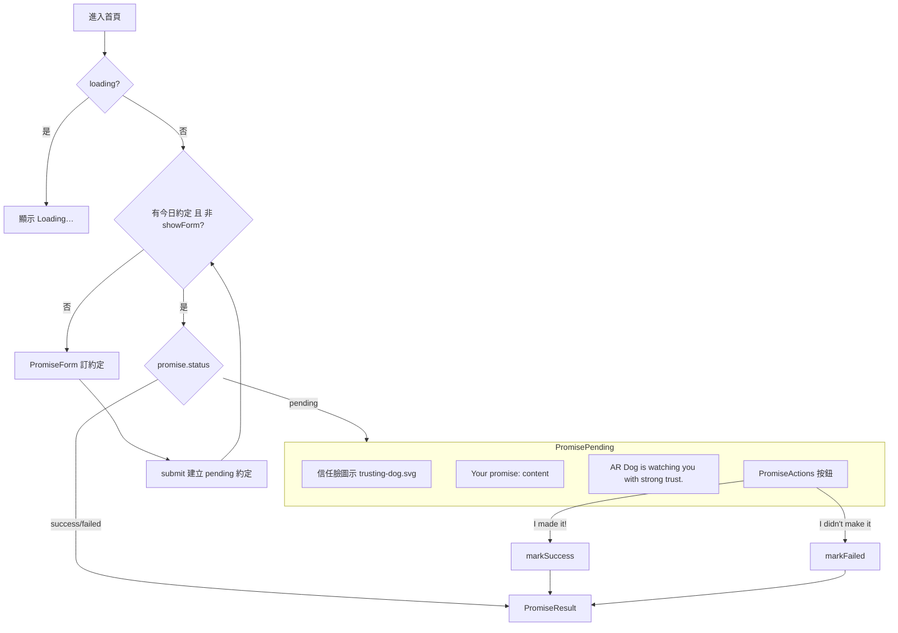

# PRD：信任凝視 UI v1（Trust Watching UI）

> 來源需求：`docs/prd/20260628.md`
> 產生日期：2026-07-07
> 功能代號：`trust-watching-ui-v1`

---

## 1. 目標與願景

### 目標

- **按鈕游標一致性**：全站所有可點擊按鈕都要有 `cursor: pointer`，避免使用者誤以為不可點。
- **強化約定後的情感連結**：使用者訂下約定後（`pending` 狀態），除了顯示約定內容，額外顯示信任文案「AR Dog is watching you with strong trust.」，並搭配一張「充滿信任感的臉」狗狗圖示。
- **視覺風格一致**：新的「信任臉」圖示需與現有 `happy-dog.svg`（成功）、`sad-dog.svg`（失敗）風格一致（同樣的圓形背景 + 狗臉構圖）。

### 願景（技術/架構方向）

- 沿用現有元件化架構，將 `pending` 狀態從 `page.tsx` 內聯 JSX 抽出為獨立、可測試的 `PromisePending` 元件，承載「約定內容 + 信任圖示 + 信任文案 + 行動按鈕」。
- 圖片沿用 `public/dog/` 的內聯 SVG 資產策略，透過 `next/image` 載入，維持 200×200 viewBox 慣例。
- 全站 `cursor: pointer` 以 Tailwind `cursor-pointer` utility class 統一補齊，不引入額外全域 CSS。

---

## 2. 功能詳述

### 2.1 全站按鈕 `cursor: pointer`

| 位置 | 檔案 | 目前 className | 調整 |
|------|------|----------------|------|
| 成癮項目選擇按鈕 | `PromiseForm.tsx` | `rounded-lg border-2 …` | 補 `cursor-pointer` |
| Make a promise 送出鈕 | `PromiseForm.tsx` | `… disabled:cursor-not-allowed` | 補 `cursor-pointer`（disabled 時仍為 not-allowed） |
| I made it! | `PromiseActions.tsx` | `… hover:bg-green-700` | 補 `cursor-pointer` |
| I didn't make it… | `PromiseActions.tsx` | `… hover:bg-red-700` | 補 `cursor-pointer` |
| Back to home | `PromiseResult.tsx` | `rounded-full bg-foreground …` | 補 `cursor-pointer` |

> 註：`PromiseForm` 送出鈕 disabled 時 Tailwind 的 `disabled:cursor-not-allowed` 優先權會覆蓋 `cursor-pointer`，符合預期（不可送出時顯示禁止游標）。

### 2.2 信任臉圖示（新資產）

| 項目 | 內容 |
|------|------|
| 檔案 | `public/dog/trusting-dog.svg` |
| viewBox | `0 0 200 200`（與 happy/sad 一致） |
| 背景圓 | `r=90`，採信任感色系（如暖黃 `#fff3c4` 或天藍 `#bbdefb`） |
| 臉部構圖 | 沿用 `ellipse` 狗臉 + 耳朵 + 鼻子，眼睛採「柔和凝視」表情（微微向上的溫柔眼、平靜嘴型） |
| `aria-label` | `充滿信任感的狗狗` |

### 2.3 約定後信任文案與圖示（pending 狀態）

當 `promise.status === 'pending'` 時，畫面顯示：

1. 「充滿信任感的臉」圖示（`trusting-dog.svg`，200×200）
2. 約定內容：`Your promise: {promise.content}`
3. 信任文案：`AR Dog is watching you with strong trust.`
4. 行動按鈕：`PromiseActions`（I made it! / I didn't make it…）

由新元件 `PromisePending` 統一渲染，`page.tsx` 改為引用該元件。

---

## 3. 業務邏輯圖



---

## 4. 參考檔案路徑

| 路徑 | 說明 |
|------|------|
| `src/app/page.tsx` | 首頁狀態機，`pending` 分支目前內聯（第 28–32 行），需改用 `PromisePending` |
| `src/components/PromiseActions.tsx` | pending 狀態的行動按鈕，需補 `cursor-pointer` |
| `src/components/PromiseForm.tsx` | 訂約定表單，radio 與 submit 按鈕需補 `cursor-pointer` |
| `src/components/PromiseResult.tsx` | 結果頁，Back to home 按鈕需補 `cursor-pointer`；可參考其圖示 + 文案 + 按鈕的排版慣例 |
| `public/dog/happy-dog.svg` / `sad-dog.svg` | 新信任臉 SVG 的風格參考 |
| `src/components/__tests__/PromiseResult.test.tsx` | 新元件測試的撰寫慣例參考 |

---

## 5. 範例程式碼

### 5.1 `public/dog/trusting-dog.svg`（風格參考，實作時微調表情）

```svg
<svg xmlns="http://www.w3.org/2000/svg" viewBox="0 0 200 200" width="200" height="200" role="img" aria-label="充滿信任感的狗狗">
  <circle cx="100" cy="100" r="90" fill="#fff3c4" />
  <ellipse cx="100" cy="110" rx="55" ry="50" fill="#d7a86e" />
  <ellipse cx="62" cy="72" rx="18" ry="30" fill="#a9743b" />
  <ellipse cx="138" cy="72" rx="18" ry="30" fill="#a9743b" />
  <!-- 柔和凝視：微微向上的溫柔眼 -->
  <path d="M72 100 Q80 94 88 100" fill="none" stroke="#3e2723" stroke-width="4" stroke-linecap="round" />
  <path d="M112 100 Q120 94 128 100" fill="none" stroke="#3e2723" stroke-width="4" stroke-linecap="round" />
  <circle cx="80" cy="102" r="6" fill="#3e2723" />
  <circle cx="120" cy="102" r="6" fill="#3e2723" />
  <ellipse cx="100" cy="122" rx="10" ry="7" fill="#3e2723" />
  <!-- 平靜、信任的微笑 -->
  <path d="M82 138 Q100 150 118 138" fill="none" stroke="#3e2723" stroke-width="5" stroke-linecap="round" />
  <path d="M100 129 V138" fill="none" stroke="#3e2723" stroke-width="4" stroke-linecap="round" />
</svg>
```

### 5.2 `src/components/PromisePending.tsx`

```tsx
import Image from 'next/image';
import { PromiseActions } from '@/components/PromiseActions';

interface PromisePendingProps {
  content: string;
  onSuccess: () => void;
  onFailed: () => void;
}

const TRUST_MESSAGE = 'AR Dog is watching you with strong trust.';

export function PromisePending({ content, onSuccess, onFailed }: PromisePendingProps) {
  return (
    <div className="flex flex-col items-center gap-4">
      <Image
        src="/dog/trusting-dog.svg"
        alt="Trusting dog"
        width={200}
        height={200}
        priority
      />
      <p className="text-lg">Your promise: {content}</p>
      <p className="text-xl font-semibold">{TRUST_MESSAGE}</p>
      <PromiseActions onSuccess={onSuccess} onFailed={onFailed} />
    </div>
  );
}
```

### 5.3 `src/app/page.tsx`（pending 分支改用元件）

```tsx
) : promise.status === 'pending' ? (
  <PromisePending
    content={promise.content}
    onSuccess={markSuccess}
    onFailed={markFailed}
  />
) : (
```

### 5.4 `cursor-pointer` 補齊範例（`PromiseActions.tsx`）

```tsx
className="flex-1 cursor-pointer rounded-full bg-green-600 px-5 py-3 font-medium text-white transition-colors hover:bg-green-700"
```

---

## 6. 驗證項目

### 單元測試（`npm test`）

- **PromisePending**
  - 渲染信任臉圖示（`alt="Trusting dog"`）
  - 顯示 `Your promise: {content}`
  - 顯示信任文案 `AR Dog is watching you with strong trust.`
  - 渲染 I made it! / I didn't make it… 兩個按鈕
  - 點擊按鈕分別呼叫 `onSuccess` / `onFailed`
- **PromiseActions**：兩個按鈕 className 含 `cursor-pointer`
- **PromiseForm**：radio 按鈕與 submit 按鈕 className 含 `cursor-pointer`
- **PromiseResult**：Back to home 按鈕 className 含 `cursor-pointer`
- **page.test.tsx**：pending 狀態下顯示信任文案（回歸測試，確保狀態機接線正確）

### 執行驗證

- `npm test` 全數綠燈
- `npm run build` 成功（`trusting-dog.svg` 路徑正確、無 TS 錯誤）
- `npm run lint` 無錯誤

### 畫面內驗證

- 訂下約定後，畫面同時出現：信任臉圖示 + 約定內容 + 「AR Dog is watching you with strong trust.」+ 兩個行動按鈕
- 滑鼠移到任一可點按鈕，游標變為手指（pointer）；送出鈕在 disabled 時為 not-allowed
- 信任臉圖示與 happy/sad 狗狗風格一致

---

## 7. 開發任務清單 (TODO)

> 原則：每項 ≤ 1 天（4–6 小時）。遵循 TDD：Red → Green → Refactor。

| # | 任務 | 預估 | 依賴 | 驗證 |
|---|------|------|------|------|
| 1 | 新增 `public/dog/trusting-dog.svg`，風格對齊 happy/sad 狗狗（信任表情 + 信任色背景） | 1h | - | 檔案存在、200×200 viewBox、瀏覽器可正常顯示 |
| 2 | 建立 `PromisePending` 元件：先寫 `__tests__/PromisePending.test.tsx`（圖示 alt、約定內容、信任文案、兩按鈕、click 回呼）→ RED，再實作元件 → GREEN | 2h | 1 | `npm test` 該檔綠燈 |
| 3 | `page.tsx` 的 `pending` 分支改用 `PromisePending`；更新 `page.test.tsx` 斷言 pending 狀態顯示信任文案 | 1h | 2 | `npm test` 綠燈、手動確認 pending 畫面 |
| 4 | 為 `PromiseActions` 兩按鈕補 `cursor-pointer`（先加 className 斷言測試 → RED → 補 class → GREEN） | 0.5h | - | `npm test` 綠燈 |
| 5 | 為 `PromiseForm` radio 與 submit 按鈕補 `cursor-pointer`（含測試斷言） | 0.5h | - | `npm test` 綠燈 |
| 6 | 為 `PromiseResult` Back to home 按鈕補 `cursor-pointer`（含測試斷言） | 0.5h | - | `npm test` 綠燈 |
| 7 | 整體驗證：`npm test`、`npm run build`、`npm run lint`，並手動走查 pending 畫面與各按鈕游標 | 0.5h | 1–6 | 全數通過 |

**建議實作順序**：1 → 2 → 3（核心功能）→ 4 → 5 → 6（游標一致性）→ 7（整體驗證）。任務 4/5/6 彼此無依賴，可並行。
